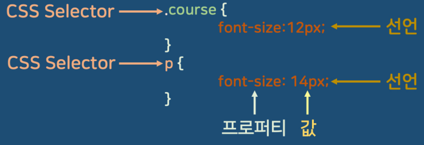

<!-- *NOTE* for write markdown -->

<!-- 
  ## => seciton
  <del>### => chapter in section </del>
  ### => contents in section(chapter)

  🚫#### 헤더는 사용하지 않음 -> 1., 2., 와 같은 리스트로 사용

  📌 섹션으로 구분하며 챕터는 구분하지 않음
  📌 단, 섹션의 하위에 사용되는 학습자료를 적어둠
    ## Section2. 풀스택 큰그림 이해하기
    > [1_understand_fullstack.ipynb](00_MATERIALS/1_understand_fullstack.ipynb "1_understand_fullstack.ipynb")
  📌 학습자료는 00_MATERIALS 폴더에 저장
  📌 이미지는 ref_images 폴더에 저장
  📌 강의 듣는 도중 이해가 되지 않는 기술에 대해서는 포스트 작성
  📌 듣는도중 의견이나 아이디어가 있으면 아래와 같은 comment 작성
    💡 (의견이나 생각) - (강의제목 시간)
    💡 frontend / backend 의 설명이 잘 되어 있음 - 프론트엔드와 백엔드 기본 구성 06:30
★☆☆ : Importance
-->

# Front-End
## References
- [HTML tag reference - https://www.w3schools.com/tags/default.asp](https://www.w3schools.com/tags/default.asp "HTML tag reference")
- [HTML Input Types - https://www.w3schools.com/tags/tag_input.asp](https://www.w3schools.com/tags/tag_input.asp "HTML Input Types")
- [HTML validation - https://validator.w3.org/#validate_by_uri](https://validator.w3.org/#validate_by_uri "HTML validation")
- [웹 접근성 진단 서비스 - https://accessibility.kr/](https://accessibility.kr/ "웹 접근성 진단 서비스")
- [WEBP 지원 브라우저 확인 - https://caniuse.com/webp](https://caniuse.com/webp "WEBP 지원 브라우저 확인")
- [Google Material Color Palette - https://m2.material.io/design/color/the-color-system.html#tools-for-picking-colors](https://m2.material.io/design/color/the-color-system.html#tools-for-picking-colors "Google Material Color Palette")
- [Adobe Color - https://color.adobe.com/ko/explore](https://color.adobe.com/ko/explore "Adobe Color")
- [CSS Diner](https://flukeout.github.io/ "CSS Diner")
- [liveweave - css 연습 사이트](https://liveweave.com/# "liveweave - css 연습 사이트")


## Table of Contents
- [Front-End](#front-end)
  - [References](#references)
  - [Table of Contents](#table-of-contents)
  - [Section1. 강의 준비](#section1-강의-준비)
    - [설치](#설치)
  - [Section2. 모던 웹 기본 기술 이해](#section2-모던-웹-기본-기술-이해)
    - [웹 기본 기술 이해와 정리](#웹-기본-기술-이해와-정리)
    - [HTML](#html)
      - [⭐️ 주요 META NAME(가장 일반적으로 많이 사용)](#️-주요-meta-name가장-일반적으로-많이-사용)
      - [호환성 관련 태그](#호환성-관련-태그)
      - [반응형 웹 관련 태그](#반응형-웹-관련-태그)
      - [LINK](#link)
      - [STYLE](#style)
      - [주요 body 내의 태그](#주요-body-내의-태그)
      - [Semantic Web](#semantic-web)
      - [알아둘 사항](#알아둘-사항)
      - [이미지](#이미지)
  - [Section3. 모던 웹의 핵심 상세한 CSS 기본](#section3-모던-웹의-핵심-상세한-css-기본)
    - [CSS 기본 정리](#css-기본-정리)
      - [CSS란?](#css란)
      - [Selector(CSS Selector 라고도 함)](#selectorcss-selector-라고도-함)
      - [HTML CSS 연동 방법](#html-css-연동-방법)
        - [1. 적용할 태그에 style 속성으로 넣기(해당 태그에만 적용)](#1-적용할-태그에-style-속성으로-넣기해당-태그에만-적용)
        - [2. HTML 문서 `<head>`에 `<style>...</style>` 태그로 넣기(전체 문서에 적용)](#2-html-문서-head에-stylestyle-태그로-넣기전체-문서에-적용)
        - [3. HTML 문서 `<head>`안에 CSS 파일로 링크하기(전체 문서에 적용)](#3-html-문서-head안에-css-파일로-링크하기전체-문서에-적용)
      - [Reset CSS](#reset-css)
    - [CSS 단위](#css-단위)
      - [CSS 크기 단위](#css-크기-단위)
      - [반응형 Viewport 단위](#반응형-viewport-단위)
        - [Viewport 단위](#viewport-단위)
      - [색상 표현 단위](#색상-표현-단위)
    - [CSS Selector](#css-selector)
      - [복합 Selector(Combinator)](#복합-selectorcombinator)
        - [1. 후손 셀렉터(Descendant Selector)](#1-후손-셀렉터descendant-selector)
        - [2. 자식 셀렉터(Child Selector)](#2-자식-셀렉터child-selector)
        - [3. 인접 형제 셀렉터(Adjacent Sibling Selector)](#3-인접-형제-셀렉터adjacent-sibling-selector)
        - [4. 일반 형제 셀렉터(General Sibling Selector)](#4-일반-형제-셀렉터general-sibling-selector)
      - [가상 클래스 셀렉터(Pseudo-class Selector)](#가상-클래스-셀렉터pseudo-class-selector)
        - [가상클래스 종류](#가상클래스-종류)
        - [UI 요소 상태 셀렉터(UI Element State Pseudo-Class)](#ui-요소-상태-셀렉터ui-element-state-pseudo-class)
    
---

## Section1. 강의 준비
### 설치
> - 📕PDF
>     - [x] [00_Preparation.pdf](https://drive.google.com/file/d/1TJ0KkEzyqJiwDax4bvAxFS34ar49OVJQ/view?usp=drive_link "00_Preparation.pdf")

--- 

## Section2. 모던 웹 기본 기술 이해

> - 📁Folder
>     - [x] [01_head](Materials/01_head "01_head")
> - 📕PDF
>     - [x] [01_html정리.pdf](https://drive.google.com/file/d/1lXknhzfqBIp-l_rE3z46yaC3dlEURHw8/view?usp=drive_link "01_html정리.pdf")


### 웹 기본 기술 이해와 정리
1. HTML : Hyper Text Markup Language의 약자로 웹사이트를 만들기 위한 **기본적인 언어**
    <p style="text-align:;">
        
    </p>

    - `<!DOCTYPE html>`: HTML5라는 신조어로 **문서를 선언**하는 태그 
    - `<html>...</html>`: HTML 문서의 **시작과 끝을 의미**하며 모든 HTML 태그들은 `<html>`태그 안쪽으로 입력
    - `<head>...</head>`: 웹사이트의 간단한 **요약정보를 담는 영역**이고 웹사이트에서 노출되지 않는 정보 
    - `<body>...</body>`: 웹사이트에서 눈에 보이는 **정보를 담는 영역**으로, 이미지나 텍스트 처럼 출력되는 정보
    - `<meta charset="UTF-8>`: character setting의 약자를 나타내는 문자코드로, 모든 문자를 웹 브라우저에서 **깨짐없이 표시**하겠다는 의미 
    - `<tittle>...</tittle>`: 웹사이트 탭에 나타나는 **제목을 적는 태그**

2. CSS 언어 
    - Cascading Style Sheets의 약자로 HTML 문서의 **스타일을 지정**하는 언어
    <p style="text-align:;">
        
    </p>

    - CSS 언어 적용하기
        1. 적용할 태그에 style 속성으로 넣기(해당 태그에만 적용)
        2. HTML 문서 `<head>`에 `<style>...</style>` 태그로 넣기(전체 문서에 적용)
        3. HTML 문서 `<head>`안에 CSS 파일로 링크하기(전체 문서에 적용)
            **<u>Example</u>**
            ```html
            <head>
                <link rel="stylesheet" href="style.css">
            </head>
            ```

3. javascript - ES6
    - 웹사이트에 **동적인 기능을 추가**하는 언어

### HTML
> - 📕PDF
>     - [x] [01_html정리.pdf](https://drive.google.com/file/d/1lXknhzfqBIp-l_rE3z46yaC3dlEURHw8/view?usp=drive_link "01_html정리.pdf")
> - 🧪실습파일
>     - [x] [html](https://codesandbox.io/p/sandbox/html-jgdr7 "Go to url")
>     - [x] [html_tag](https://codesandbox.io/p/sandbox/htmltag-ueveh?file=%2Fsrc%2Findex.js%3A1%2C1-2%2C1 "Go to url")


#### ⭐️ 주요 META NAME(가장 일반적으로 많이 사용)


```html
<meta name="desription" content="웹사이트 설명">  
<meta name="keywords" content="키워드1, 키워드2, 키워드3">
<meta name="author" content="작성자">
```

- `desription`: 웹사이트 설명
- `keywords`: 해당 페이지가 어떤 키워드로 검색되는지
- `author`: 웹사이트 작성자

#### 호환성 관련 태그 
```html
<meta http-equiv="X-UA-Compatible" content="IE=edge">
```
- 인터넷 익스플로러(ID)에서 최신 표준 모드로 렌더린 되도록 하는 설정

#### 반응형 웹 관련 태그
```html
<meta name="viewport" content="width=device-width, user-scalable=no, initial-scale=1.0, maximum-scale=1.0, minimum-scale=1.0" >
```
- viewport: 웹사이트가 보여지는 화면의 크기를 설정하는 태그

|     속성      | 설명                                         | 주요값                                                        |
| :-----------: | -------------------------------------------- | ------------------------------------------------------------- |
|     width     | 초기 뷰포트 너비 설정                        | **device-width** 또는 양의 정수(디바이스 너비 또는 특정 너비) |
| user-scalable | 사용자가 뷰포트 크기를 조정할 수 있는지 여부 | **yes** 또는 **no**(조정 가능 또는 불가능)                    |
| initial-scale | 디바이스 너비와 뷰포트 너비 비율 설정        | 0.0과 10.0사이 수(주로 1.0을 많이 사용함)                     |
| maximum-scale | 최대 확대/축소 비율 설정                     | 0.0과 10.0사이 수(주로 1.0을 많이 사용함)                     |
| minimum-scale | 최소 확대/축소 비율 설정                     | 0.0과 10.0사이 수(주로 1.0을 많이 사용함)                     |

#### LINK
```html
<link rel="stylesheet" href="style.css">
<link rel="stylesheet" href="favicon.ico">
```

| 속성  | 설명                                  | 주요값                                       |
| :---: | ------------------------------------- | -------------------------------------------- |
|  rel  | html 문서와 외부 데이터와의 관계 표시 | **stylesheet**(스타일시트), **icon**(아이콘) |
| href  | 외부 데이터의 경로                    | 파일 경로(상대 경로 또는 절대 경로로 설정)   |

#### STYLE
```html
<style>
    body {
        background-color: #f0f0f0;
        color: #333;
        font-family: Arial, sans-serif;
    }
```

#### 주요 body 내의 태그

1. `<h1> ~ <h6>`: 제목 태그로, `<h1>`이 가장 큰 제목
    > 현업에서는 웹브라우저 호환성을 위해, 태그에 표현 서식이 들어 있는 경우 모두 삭제하고 CSS style을 별도로 적용

2. `<p>`: 문단 태그로, 문단을 구분하는 태그

3. `<a>`: 링크 태그로, 다른 페이지로 이동하는 링크를 생성하는 태그
    ```html
    <a href="https://www.naver.com" target="_blank">네이버</a>
    ```

    - `href`: 링크 주소
    - `target`: 링크를 클릭했을 때 새 창으로 열지 여부
        - `_blank`: 새 창으로 열기
        - `_self`: 현재 창에서 열기(기본값)
        - `_parent`: 부모 프레임에서 열기
        - `_top`: 전체 창에서 열기


4. `<ol>, <ul>, <li>`: 리스트 태그로, 순서가 있는 리스트와 순서가 없는 리스트를 생성하는 태그
    ```html
    <ol>
        <li>1번</li>
        <li>2번</li>
        <li>3번</li>
    </ol>
    <ul>
        <li>1번</li>
        <li>2번</li>
        <li>3번</li>
    </ul>
    ```

    - `<ol>`: 순서가 있는 리스트
    - `<ul>`: 순서가 없는 리스트

5. ``: 이미지 태그로, 이미지를 삽입하는 태그
    ```html
    
    ```
    | 속성  | 설명        | 주요값                                |
    | :---: | ----------- | ------------------------------------- |
    |  src  | 이미지 경로 | 상대경로 또는 절대경로로 설정         |
    |  alt  | 이미지 설명 | 이미지가 로드되지 않을 때 대체 텍스트 |

    > alt는 웹접근성을 높이는 필수 속성처럼 다루는 것이 좋음(구글 SEO 문서에서도 강조)

6. `<div>`: 블록 레벨 태그로, 구역을 나누는 태그
    - division의 약자로, html 문서의 특정 부분을 지정하는데 사용(화면에 표시가 달라지는 부분은 아님)
    - `div` 태그는 CS 또는 javascript와 함께 사용하여 레이아웃을 구성하는 데 많이 사용됨
    ```html
    <div>
        <h1>제목</h1>
        <p>내용</p>
    </div>
    ```

7. `<table>`: 테이블 태그로, 표를 생성하는 태그
    ```html
    <table>
        <thead>
            <tr>
                <th>제목1</th>
                <th>제목2</th>
            </tr>
        </thead>
        <tbody>
            <tr>
                <td>내용1</td>
                <td>내용2</td>
            </tr>
            <tr>
                <td>내용3</td>
                <td>내용4</td>
            </tr>
        </tbody>
        <tfoot>
            <tr>
                <td>합계1</td>
                <td>합계2</td>
            </tr>
        </tfoot>
    </table>
    ```

    - `<thead>`: 테이블의 제목 부분
    - `<th>`: 테이블의 제목 셀
    - `<tbody>`: 테이블의 본문 부분
    - `<tr>`: 테이블의 행(row)
    - `<td>`: 테이블의 데이터 셀
    - `<tfoot>`: 테이블의 마지막 행

    <br>

    > thead나 tfoot은 생략 가능하거나 한번만 나와야하며, tfoot은 thead보다 뒤에 위치
    > tr과 td로만 구성해도 문제없음

8. `<form>`: 폼 태그로, 사용자 입력을 받는 폼을 생성하는 태그, `<input>` 태그와 함께 사용
    |  속성  | 설명                     | 주요값                                                                             |
    | :----: | ------------------------ | ---------------------------------------------------------------------------------- |
    | action | 폼 제출 시 이동할 URL    | URL                                                                                |
    | method | 폼 제출 방식             | **GET** 또는 **POST**                                                              |
    | target | 폼 제출 시 이동할 프레임 | **_blank**(새 창), **_self**(현재 창), **_parent**(부모 프레임), **_top**(전체 창) |

9. `<input>`: 입력 태그로, 사용자 입력을 받는 태그
    - 참고: [HTML Input Types](https://www.w3schools.com/tags/tag_input.asp)
    
    ```html
    <input type="text" name="이름" placeholder="이름을 입력하세요">
    ```
    |     속성     | 설명           | 주요값                                                                                   |
    | :----------: | -------------- | ---------------------------------------------------------------------------------------- |
    |     type     | 입력 타입      | **text**(텍스트), **password**(비밀번호), **checkbox**(체크박스), **radio**(라디오 버튼) |
    |  maxlength   | 최대 길이      | 입력 필드에 입력할 수 있는 최대 문자 수                                                  |
    |  minlength   | 최소 길이      | 입력 필드에 입력할 수 있는 최소 문자 수                                                  |
    |  autofocus   | 자동 포커스    | 페이지 로드 시 자동으로 커서가 놓이도록 하는 설정                                        |
    | autocomplete | 자동 완성 여부 | **on**(자동 완성), **off**(자동 완성 안함)                                               |
    |   **name**   | 입력 필드 이름 | 서버로 **전송되는 데이터의 이름**                                                        |
    |    value     | 기본값         | 입력 필드의 기본값                                                                       |
    |   required   | 필수 입력 여부 | **required**(필수 입력)                                                                  |
    |   disabled   | 비활성화 여부  | **disabled**(비활성화)                                                                   |

#### Semantic Web
- html5에서 추가된 태그로, 웹사이트의 구조를 명확하게 정의하는 태그
- **구조화**하여 검색 엔진이 이해할 수 있도록 하는 기술

    | 시멘틱 웹 태그 | 설명                                      |
    | :------------: | :---------------------------------------- |
    |     header     | 웹사이트의 머리말을 나타내는 태그         |
    |      nav       | 웹사이트의 내비게이션을 나타내는 태그     |
    |     aside      | 웹사이트의 사이드바를 나타내는 태그       |
    |    section     | 본문의 여러 내용(article)을 포함하는 부분 |
    |    article     | 본문의 주 내용이 들어가는 부분            |
    |     footer     | 웹사이트의 바닥글을 나타내는 태그         |

    <p style="text-align: ;">
        
    </p>

#### 알아둘 사항
1. 웹 표준 
2. 웹 접근성
3. 크로스 브라우징 : 웹사이트가 다양한 브라우저에서 동일하게 보이도록 하는 것

#### 이미지
- 이미지는 비트맵과 벡터 이미지로 구분
    - 비트맵: 픽셀로 구성된 이미지
        - 정교하고 다양한 색상을 표현할 수 있지만, **확대하면 픽셀이 깨짐**
        - JPG, PNG, GIF, BMP
    - 벡터 이미지: 수학적 공식으로 구성된 이미지
        - 확대해도 깨지지 않지만, **색상 표현이 제한적**
        - SVG, AI, EPS


1. JPEG(JPG) : 높은 압축률 
    - 손실 압축 방식(원본 이미지와 일부 다른 정보)

2. GIF
    - 8비트 색상(256색)
    - 비손실 압축 방식(원본 이미지와 동일한 정보)

3. PNG
    - W3C 권장 이미지 포맷
    - 비손실 압축 방식(원본 이미지와 동일한 정보), 단 파일 용량이 큼

4. <span style='color: #000000; background-color: #eecef2'>**⭐️WEBP : 동영상, 투명도 지원되는 JPG, PNG, GIF 모두 지원**</span>
    - Google 에서 개발한 이미지 포맷
    - 일부 브라우저에서 미지원
    - 손실/비손실 압축 방식 모두 지원
        
        
## Section3. 모던 웹의 핵심 상세한 CSS 기본
### CSS 기본 정리
> - 📕PDF
>     - [x] [02_css_기본정리](https://drive.google.com/file/d/1DxiRLXVQvC4DAX8rjNiyn7-c5PDbnjm6/view?usp=drive_link "02_css_기본정리")
> - 🧪실습파일
>     - <blank>

#### CSS란?
- Cascading Style Sheets의 약자로 HTML 문서의 **스타일을 지정**하는 언어
- HTML로 구조화된 문서를 어떻게 브라우저 상에 렌더링할지 표현 방법을 정의하기 위한 언어
- 현재 사용하는 CSS는 CSS3로, CSS2의 모든 기능을 포함하고 있으며, CSS2.1에서 추가된 기능도 포함
    <p style="text-align:;">
        
    </p>

#### Selector(CSS Selector 라고도 함)
- CSS에서 스타일을 적용할 HTML 요소를 선택하는 방법
    <p style="text-align: ;">
        
    </p>


#### HTML CSS 연동 방법
##### 1. 적용할 태그에 style 속성으로 넣기(해당 태그에만 적용)
> 가급적 지양할 것
```html
<!DOCTYPE html>
<html>
    <body>
        <h1 style="color:blue;">Hello World!</h1>
        <p style="color:red;">This is a paragraph.</p>
    </body>
</html>
```

##### 2. HTML 문서 `<head>`에 `<style>...</style>` 태그로 넣기(전체 문서에 적용)
```html
<!DOCTYPE html>
<html>
    <head>
        <style>
            h1 {
                color: blue;
            }
            p {
                color: red;
            }
        </style>
    </head>
    <body>
        <h1>Hello World!</h1>
        <p>This is a paragraph.</p>
    </body>
</html>
```


##### 3. HTML 문서 `<head>`안에 CSS 파일로 링크하기(전체 문서에 적용)
- home.html
    ```html
    <!DOCTYPE html>
    <html>
        <head>
            <link rel="stylesheet" href="style.css">
        </head>
        <body>
            <h1>Hello World!</h1>
            <p>This is a paragraph.</p>
        </body>
    </html>
    ```

- style.css
    ```css
    h1 {
        color: blue;
    }
    p {
        color: red;
    }
    ```

#### Reset CSS
- 웹 브라우저마다 기본 스타일이 다르기 때문에, 모든 브라우저에서 동일한 스타일을 적용하기 위해 사용
    > 실무에서 필요에 의해 임의로 만든 설정
- 최근에는 normalize.css를 많이 사용
    - cdn(Contents Delivery Network)을 통해서 링크하거나, npm으로 설치하여 사용
    - [https://cdnjs.com/libraries/normalize](https://cdnjs.com/libraries/normalize)
    ```html
    <link rel="stylesheet" href="https://cdnjs.cloudflare.com/ajax/libs/normalize/8.0.1/normalize.min.css">
    ```

    - css / min.css
        - css: 일반 css 파일
        - min.css: 압축된 css 파일 

### CSS 단위
#### CSS 크기 단위
> - 📕PDF
>     - [x] [03_css_단위정리.pdf](https://drive.google.com/file/d/1E2ugWfrnQuxI0oogCk9tPnRUJlLEJzds/view?usp=sharing "03_css_단위정리.pdf")
> - 🧪실습파일
>     - [x] [css 단위](https://codesandbox.io/p/sandbox/cssdanwi-u2g72 "Go to url")
>     - [x] [viewport 단위](https://codesandbox.io/p/sandbox/cssviewport-x2qrx "Go to url")

1. px
    - 픽셀(화소) 단위, 해상도에 따라 상대적인 크기를 가짐
        <p style="text-align: ;">
            
        </p>

2. %(percent)
    - 백분율 단위의 상대 단위, 지정 사이즈를 기반으로 상대적인 비율의 크기를 가짐

3. em
    - 배수 단위, 지정 사이즈를 기반으로 배수로 계산된 크기를 가짐
    - 중첩된 자식 요소에 em을 지정하면 **모든 자식 요소 사이즈에 영향을 주므로 주의**
        <p style="text-align: ;">
            
        </p>

4. rem 
    - em과 달리 rem은 root em으로, 최상위 요소(html) 사이즈를 기준으로 함


#### 반응형 Viewport 단위
    - viewport 단위는 화면 크기에 따라 상대적인 크기를 가짐

##### Viewport 단위
| 단위  | 설명                                                                 |
| :---: | -------------------------------------------------------------------- |
|  vw   | viewport width의 약자로, 뷰포트 너비의 1%를 의미                     |
|  vh   | viewport height의 약자로, 뷰포트 높이의 1%를 의미                    |
| vmin  | viewport minimum의 약자로, 뷰포트 너비와 높이 중 작은 값의 1%를 의미 |
| vmax  | viewport maximum의 약자로, 뷰포트 너비와 높이 중 큰 값의 1%를 의미   |

``` html
<!DOCTYPE html>
<html>
    <head>
        <style>
            .box {
                width: 50vw; /* 뷰포트 너비의 50% */
                height: 50vh; /* 뷰포트 높이의 50% */
                background-color: lightblue;
            }
        </style>
    </head>
    <body>
        <div class="box"></div>
    </body>
</html>
```

#### 색상 표현 단위

- [Google Material Color Palette - https://m2.material.io/design/color/the-color-system.html#tools-for-picking-colors](https://m2.material.io/design/color/the-color-system.html#tools-for-picking-colors "Google Material Color Palette")
- [Adobe Color - https://color.adobe.com/ko/explore](https://color.adobe.com/ko/explore "Adobe Color")

1. 색상 이름으로 표기하는 방법 : 주요 색상 이름 참고 [https://www.w3schools.com/colors/colors_names.asp](https://www.w3schools.com/colors/colors_names.asp "Go to url")
2. 16진수로 표기하는 방법
    - #RRGGBB 형식으로 표기
    - R: Red, G: Green, B: Blue
    - 00 ~ FF(16진수)로 표현
    - 예) #FF0000(빨강), #00FF00(초록), #0000FF(파랑)

        <p style="text-align: ;">
            
        </p>

3. RGB로 표기하는 방법
    - rgb(0 ~ 255, 0 ~ 255, 0 ~ 255) 형식으로 표기
    - 예) rgb(255, 0, 0)(빨강), rgb(0, 255, 0)(초록), rgb(0, 0, 255)(파랑)

4. RGBA로 표기하는 방법
    - rgba(0 ~ 255, 0 ~ 255, 0 ~ 255, 0.0 ~ 1.0) 형식으로 표기
    - 예) rgba(255, 0, 0, 0.5)(빨강 반투명), rgba(0, 255, 0, 1.0)(초록 불투명), rgba(0, 0, 255, 0.2)(파랑 투명)

### CSS Selector
> - 📕PDF
>     - [x] [04_css_selector.pdf](https://drive.google.com/file/d/1ZRi4JNYhdTVvQcYU3xyiaoGCeRd1LFy3/view?usp=sharing "04_css_selector.pdf")
> - 🧪실습파일
>     - [x] [css_selector](https://codesandbox.io/p/sandbox/cssselector-r59je?file=%2Fsrc%2Findex.js "Go to url")

> PDF 참조

#### 복합 Selector(Combinator)
- 후손 셀렉터(Descendant Selector) : 스페이스로 표시 
- 자식 셀렉터(Child Selector) : >로 표시
- 인접 형제 셀렉터(Adjacent Sibling Selector) : +로 표시
- 일반 형제 셀렉터(General Sibling Selector) : ~로 표시

##### 1. 후손 셀렉터(Descendant Selector)
- 부모 태그 안에 있는 모든 하위 태그를 하위 요소, 후손 요소라고 부름
```css
div p {
    color: red;
}
```

##### 2. 자식 셀렉터(Child Selector)
- 부모 태그 안에 있는 **바로 다음 레벨**의 태그 선택
```css
div > p {
    color: red;
}
```
- `div` 태그 안에 있는 p 태그 중에서 div 태그의 **직계 자식**인 p 태그만 선택

##### 3. 인접 형제 셀렉터(Adjacent Sibling Selector)
- 특정 태그 바로 다음에 오는 형제 태그를 선택
    - *사이에 다른 태그가 없어야 함*
``` html
<!DOCTYPE html>
<html>
    <head>
        <style>
            h1 + p {
                color: red;
            }
        </style>
    </head>
    <body>
        <h1>제목</h1>
        <p>내용</p>  (<- selector 적용)
        <p>내용2</p>
    </body>
</html>
```

##### 4. 일반 형제 셀렉터(General Sibling Selector)
- 특정 태그 다음에 오는 형제 태그를 선택
    - *사이에 다른 태그가 있어도 상관 없음*
``` css
h1 ~ p {
    color: red;
}
```

#### 가상 클래스 셀렉터(Pseudo-class Selector)
> - 🧪실습파일
>     - [x] [Pseudo-class Selector](https://codesandbox.io/p/sandbox/css-pseudo-class-selector-1z7sm "Go to url")
>     - [x] [UI Element State Pseudo-Class](https://codesandbox.io/p/sandbox/css-ui-element-pseudo-class-selector-mecrs "Go to url")

##### 가상클래스 종류
| 순번  | 가상클래스 | 설명                           |
| :---: | :--------- | ------------------------------ |
|   1   | :link      | 링크가 클릭되지 않은 상태      |
|   2   | :visited   | 링크가 클릭된 상태             |
|   3   | :hover     | 마우스가 링크 위에 올라간 상태 |
|   4   | :active    | 링크가 클릭된 상태             |
|   5   | :focus     | 링크가 포커스된 상태           |

```html
    <style>
      a:link {
        color: red;
      }
      a:visited {
        color: blue;
      }
      a:hover {
        color: green;
      }
      a:active {
        color: gray;
      }
      input:focus {
        color: brown;
      }
    </style>
```

##### UI 요소 상태 셀렉터(UI Element State Pseudo-Class)
- enabled : Ui 셀렉터가 사용 가능한 상태
- disabled : Ui 셀렉터가 사용 불가능한 상태
- checked : Ui 셀렉터가 체크된 상태
- indeterminate : UI 셀렉터 상태가 결정되지 않은 상태(예: 체크박스가 체크되지 않은 상태, 라디오 버튼이 하나도 선택되지 않은 상태)

```html
<!DOCTYPE html>
<html lang="ko">
  <head>
    <meta charset="UTF-8" />
    <style>
      input[type="radio"]:indeterminate + span {
        color: red;
      }
      input[type="radio"]:checked + span {
        color: orange;
      }
      input[type="checkbox"]:enabled + span {
        color: blue;
      }
      input[type="checkbox"]:disabled + span {
        color: green;
      }
    </style>
  </head>
  <body>
    <div>
      <h1>Dave Lee</h1>
      <a href="https://www.fun-coding.org/">잔재미코딩</a>
      <form action="https://www.fun-coding.org/" method="get">
        <input type="radio" value="item1" name="item" /><span>item1</span><br />
        <input type="radio" value="item2" name="item" /><span>item2</span><br />

        <input type="checkbox" value="check1" name="check" /><span>check1</span
        ><br />
        <input type="checkbox" value="check2" name="check" disabled /><span
          >check2</span
        ><br />

        <input type="text" id="data" name="data" /><br />
        <input type="submit" value="Submit" />
      </form>
    </div>
  </body>
</html>
```
