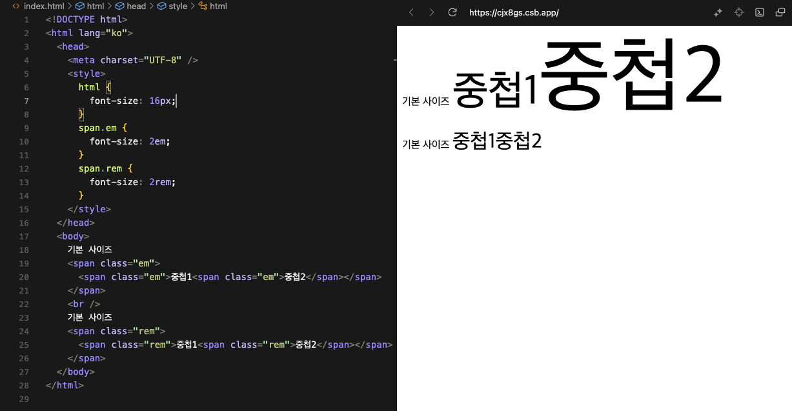

<!-- *NOTE* for write markdown -->

<!-- 
  ## => seciton
  <del>### => chapter in section </del>
  ### => contents in section(chapter)

  🚫#### 헤더는 사용하지 않음 -> 1., 2., 와 같은 리스트로 사용

  📌 섹션으로 구분하며 챕터는 구분하지 않음
  📌 단, 섹션의 하위에 사용되는 학습자료를 적어둠
    ## Section2. 풀스택 큰그림 이해하기
    > [1_understand_fullstack.ipynb](00_MATERIALS/1_understand_fullstack.ipynb "1_understand_fullstack.ipynb")
  📌 학습자료는 00_MATERIALS 폴더에 저장
  📌 이미지는 ref_images 폴더에 저장
  📌 강의 듣는 도중 이해가 되지 않는 기술에 대해서는 포스트 작성
  📌 듣는도중 의견이나 아이디어가 있으면 아래와 같은 comment 작성
    💡 (의견이나 생각) - (강의제목 시간)
    💡 frontend / backend 의 설명이 잘 되어 있음 - 프론트엔드와 백엔드 기본 구성 06:30
★☆☆ : Importance
-->

# 1 Front-End
## 1.1 References
- HTML 관련
    - [HTML tag reference - https://www.w3schools.com/tags/default.asp](https://www.w3schools.com/tags/default.asp "HTML tag reference")
    - [HTML Input Types - https://www.w3schools.com/tags/tag_input.asp](https://www.w3schools.com/tags/tag_input.asp "HTML Input Types")
    - [HTML validation - https://validator.w3.org/#validate_by_uri](https://validator.w3.org/#validate_by_uri "HTML validation")

- WEB 관련
    - [웹 접근성 진단 서비스 - https://accessibility.kr/](https://accessibility.kr/ "웹 접근성 진단 서비스")
    - [WEBP 지원 브라우저 확인 - https://caniuse.com/webp](https://caniuse.com/webp "WEBP 지원 브라우저 확인")

- Color 관련
    - [Google Material Color Palette - https://m2.material.io/design/color/the-color-system.html#tools-for-picking-colors](https://m2.material.io/design/color/the-color-system.html#tools-for-picking-colors "Google Material Color Palette")
    - [Adobe Color - https://color.adobe.com/ko/explore](https://color.adobe.com/ko/explore "Adobe Color")

- CSS 관련
    - [Border styles](https://developer.mozilla.org/en-US/docs/Web/CSS/border-style "Border styles")
    - [Border radius](https://developer.mozilla.org/en-US/docs/Web/CSS/border-radius "Border radius")
    - [Background size](https://cssreference.io/property/background-size/ "Background size")
    - [transform-origin](https://developer.mozilla.org/en-US/docs/Web/CSS/transform-origin "transform-origin")
    - [CSS inheritance reference](https://www.w3.org/TR/CSS2/propidx.html "CSS inheritance reference")
    - [명시도 계산 (CSS Specificity)](https://specificity.keegan.st/ "명시도 계산 (CSS Specificity)")
    - [CSS Reset](https://cdnjs.cloudflare.com/ajax/libs/normalize/8.0.1/normalize.min.css "CSS Reset")

- CSS 연습 관련
    - [Flexbox Playground - https://flexbox.tech/]("https://flexbox.tech/" "Flexbox Playground")
    - [Flexbox Froggy - https://flexboxfroggy.com/#ko](https://flexboxfroggy.com/#ko "Flexbox Froggy")
    - [CSS Diner(CSS Selector 연습)](https://flukeout.github.io/ "CSS diner(CSS Selector 연습)")
    - [liveweave - css 연습 사이트](https://liveweave.com/# "liveweave - css 연습 사이트")

- ETC
    - [fontawesome - html icon](https://fontawesome.com/kits/new "fontawesome")


## 1.2 Table of Contents
- [1 Front-End](#1-front-end)
  - [1.1 References](#11-references)
  - [1.2 Table of Contents](#12-table-of-contents)
  - [1.3 Section1. 강의 준비](#13-section1-강의-준비)
    - [1.3.1 설치](#131-설치)
  - [1.4 Section2. 모던 웹 기본 기술 이해](#14-section2-모던-웹-기본-기술-이해)
    - [1.4.1 웹 기본 기술 이해와 정리](#141-웹-기본-기술-이해와-정리)
    - [1.4.2 HTML](#142-html)
      - [1.4.2.1 ⭐️ 주요 META NAME(가장 일반적으로 많이 사용)](#1421-️-주요-meta-name가장-일반적으로-많이-사용)
      - [1.4.2.2 호환성 관련 태그](#1422-호환성-관련-태그)
      - [1.4.2.3 반응형 웹 관련 태그](#1423-반응형-웹-관련-태그)
      - [1.4.2.4 LINK](#1424-link)
      - [1.4.2.5 STYLE](#1425-style)
      - [1.4.2.6 주요 body 내의 태그](#1426-주요-body-내의-태그)
      - [1.4.2.7 Semantic Web](#1427-semantic-web)
      - [1.4.2.8 알아둘 사항](#1428-알아둘-사항)
      - [1.4.2.9 이미지](#1429-이미지)
  - [1.5 Section3. 모던 웹의 핵심 상세한 CSS 기본](#15-section3-모던-웹의-핵심-상세한-css-기본)
    - [1.5.1 CSS 기본 정리](#151-css-기본-정리)
      - [1.5.1.1 CSS란?](#1511-css란)
      - [1.5.1.2 Selector(CSS Selector 라고도 함)](#1512-selectorcss-selector-라고도-함)
      - [1.5.1.3 HTML CSS 연동 방법](#1513-html-css-연동-방법)
        - [1.5.1.3.1 적용할 태그에 style 속성으로 넣기(해당 태그에만 적용)](#15131-적용할-태그에-style-속성으로-넣기해당-태그에만-적용)
        - [1.5.1.3.2 HTML 문서 `<head>`에 `<style>...</style>` 태그로 넣기(전체 문서에 적용)](#15132-html-문서-head에-stylestyle-태그로-넣기전체-문서에-적용)
        - [1.5.1.3.3 HTML 문서 `<head>`안에 CSS 파일로 링크하기(전체 문서에 적용)](#15133-html-문서-head안에-css-파일로-링크하기전체-문서에-적용)
      - [1.5.1.4 Reset CSS](#1514-reset-css)
    - [1.5.2 CSS 단위](#152-css-단위)
      - [1.5.2.1 CSS 크기 단위](#1521-css-크기-단위)
      - [1.5.2.2 반응형 Viewport 단위](#1522-반응형-viewport-단위)
        - [1.5.2.2.1 Viewport 단위](#15221-viewport-단위)
      - [1.5.2.3 색상 표현 단위](#1523-색상-표현-단위)
    - [1.5.3 CSS Selector](#153-css-selector)
      - [1.5.3.1 속성 Selector](#1531-속성-selector)
        - [1.5.3.1.1 `[속성~="값"]` - 속성값이 "값"을 (공백으로 분리된) 포함하는 경우](#15311-속성값---속성값이-값을-공백으로-분리된-포함하는-경우)
        - [1.5.3.1.2 `[속성|="값"]` - 속성값이 "값"이거나 "값-"으로 시작하는 모든 태그(요소)(ex: "en-US")](#15312-속성값---속성값이-값이거나-값-으로-시작하는-모든-태그요소ex-en-us)
        - [1.5.3.1.3 `[속성^="값"]` - 속성값이 "값"으로 시작하는 경우](#15313-속성값---속성값이-값으로-시작하는-경우)
        - [1.5.3.1.4 `[속성$="값"]` - 속성값이 "값"으로 끝나는 경우](#15314-속성값---속성값이-값으로-끝나는-경우)
        - [1.5.3.1.5 `[속성*="값"]` - 속성값이 "값"을 포함하는 경우](#15315-속성값---속성값이-값을-포함하는-경우)
      - [1.5.3.2 복합 Selector(Combinator)](#1532-복합-selectorcombinator)
        - [1.5.3.2.1 후손 셀렉터(Descendant Selector)](#15321-후손-셀렉터descendant-selector)
        - [1.5.3.2.2 자식 셀렉터(Child Selector)](#15322-자식-셀렉터child-selector)
        - [1.5.3.2.3 인접 형제 셀렉터(Adjacent Sibling Selector)](#15323-인접-형제-셀렉터adjacent-sibling-selector)
        - [1.5.3.2.4 일반 형제 셀렉터(General Sibling Selector)](#15324-일반-형제-셀렉터general-sibling-selector)
      - [1.5.3.3 가상 클래스 셀렉터(Pseudo-class Selector)](#1533-가상-클래스-셀렉터pseudo-class-selector)
        - [1.5.3.3.1 가상클래스 종류](#15331-가상클래스-종류)
        - [1.5.3.3.2 UI 요소 상태 셀렉터(UI Element State Pseudo-Class)](#15332-ui-요소-상태-셀렉터ui-element-state-pseudo-class)
        - [1.5.3.3.3 구조 가상 클래스 셀렉터(Structural Pseudo-Class Selector)](#15333-구조-가상-클래스-셀렉터structural-pseudo-class-selector)
        - [1.5.3.3.4 부정 셀렉터(Negation Pseudo-Class Selector)](#15334-부정-셀렉터negation-pseudo-class-selector)
        - [1.5.3.3.5 정합성 체크 셀렉터(Validity Pseudo-Class Selector)](#15335-정합성-체크-셀렉터validity-pseudo-class-selector)
        - [1.5.3.3.6 가상 요소 셀렉터(Pseudo-element Selector)](#15336-가상-요소-셀렉터pseudo-element-selector)
  - [1.6 Section4. 모던 웹의 핵심 상세한 CSS 기본 프로퍼티](#16-section4-모던-웹의-핵심-상세한-css-기본-프로퍼티)
    - [1.6.1 CSS BOX MODEL(박스 모델) 이해](#161-css-box-model박스-모델-이해)
      - [1.6.1.1 BOX Model property](#1611-box-model-property)
      - [1.6.1.2 주요 프로퍼티property](#1612-주요-프로퍼티property)
        - [1.6.1.2.1 width, height](#16121-width-height)
        - [1.6.1.2.2 margin / padding](#16122-margin--padding)
        - [1.6.1.2.3 참고](#16123-참고)
        - [1.6.1.2.4 border](#16124-border)
        - [1.6.1.2.5 box-sizing](#16125-box-sizing)
    - [1.6.2 CSS background 이해](#162-css-background-이해)
      - [1.6.2.1 background-image 프로퍼티](#1621-background-image-프로퍼티)
      - [1.6.2.2 background-repeat 프로퍼티](#1622-background-repeat-프로퍼티)
      - [1.6.2.3 background-size 프로퍼티](#1623-background-size-프로퍼티)
      - [1.6.2.4 background-attachment 프로퍼티](#1624-background-attachment-프로퍼티)
      - [1.6.2.5 background-position 프로퍼티](#1625-background-position-프로퍼티)
      - [1.6.2.6 background-color 프로퍼티](#1626-background-color-프로퍼티)
      - [1.6.2.7 background 단축 프로퍼티](#1627-background-단축-프로퍼티)
    - [1.6.3 CSS block과 inline 이해](#163-css-block과-inline-이해)
      - [1.6.3.1 block 특성](#1631-block-특성)
      - [1.6.3.2 inline 특성](#1632-inline-특성)
      - [1.6.3.3 CSS display 프로퍼티](#1633-css-display-프로퍼티)
      - [1.6.3.4 CSS visibility 프로퍼티](#1634-css-visibility-프로퍼티)
      - [1.6.3.5 inline-block 특성](#1635-inline-block-특성)
    - [1.6.4 CSS font 이해](#164-css-font-이해)
      - [1.6.4.1 font-size 프로퍼티](#1641-font-size-프로퍼티)
      - [1.6.4.2 font-family 프로퍼티](#1642-font-family-프로퍼티)
      - [1.6.4.3 웹폰트 사용법](#1643-웹폰트-사용법)
      - [1.6.4.4 font-style 프로퍼티](#1644-font-style-프로퍼티)
      - [1.6.4.5 font-weight 프로퍼티](#1645-font-weight-프로퍼티)
      - [1.6.4.6 font-variant 프로퍼티](#1646-font-variant-프로퍼티)
      - [1.6.4.7 line-height 프로퍼티](#1647-line-height-프로퍼티)
      - [1.6.4.8 font 단축 프로퍼티](#1648-font-단축-프로퍼티)
      - [1.6.4.9 letter-spacing, word-spacing 프로퍼티](#1649-letter-spacing-word-spacing-프로퍼티)
      - [1.6.4.10 text-align 프로퍼티](#16410-text-align-프로퍼티)
      - [1.6.4.11 text-decoration 프로퍼티](#16411-text-decoration-프로퍼티)
      - [1.6.4.12 white-space 프로퍼티](#16412-white-space-프로퍼티)
      - [1.6.4.13 text-overflow 프로퍼티](#16413-text-overflow-프로퍼티)
  - [1.7 Section5. 모던 웹의 핵심 상세한 CSS 배치와 애니메이션](#17-section5-모던-웹의-핵심-상세한-css-배치와-애니메이션)
    - [1.7.1 CSS position 이해](#171-css-position-이해)
      - [1.7.1.1 정적 위치 (Static Position)](#1711-정적-위치-static-position)
      - [1.7.1.2 상대 위치 (Relative Position)](#1712-상대-위치-relative-position)
      - [1.7.1.3 절대 위치 (Absolute Position)](#1713-절대-위치-absolute-position)
      - [1.7.1.4 고정 위치 (Fixed Position)](#1714-고정-위치-fixed-position)
      - [1.7.1.5 z-index, overflow 프로퍼티](#1715-z-index-overflow-프로퍼티)
      - [1.7.1.6 overflow 프로퍼티](#1716-overflow-프로퍼티)
    - [1.7.2 CSS transition 이해](#172-css-transition-이해)
      - [1.7.2.1 정의](#1721-정의)
      - [1.7.2.2 주요 CSS transition 프로퍼티](#1722-주요-css-transition-프로퍼티)
      - [1.7.2.3 활용 예](#1723-활용-예)
      - [1.7.2.4 transition-timing-function](#1724-transition-timing-function)
        - [1.7.2.4.1 주요 transition-timing-function 프로퍼티 값](#17241-주요-transition-timing-function-프로퍼티-값)
      - [1.7.2.5 transition-delay](#1725-transition-delay)
      - [1.7.2.6 transition 단축 프로퍼티](#1726-transition-단축-프로퍼티)
    - [1.7.3 CSS animation 이해](#173-css-animation-이해)
      - [1.7.3.1 정의](#1731-정의)
      - [1.7.3.2 주요 CSS animation 프로퍼티](#1732-주요-css-animation-프로퍼티)
      - [1.7.3.3 keyframes 문법](#1733-keyframes-문법)
      - [1.7.3.4 주요 CSS animation 프로퍼티](#1734-주요-css-animation-프로퍼티)
      - [1.7.3.5 animation-duration, animation-delay](#1735-animation-duration-animation-delay)
      - [1.7.3.6 animation-iteration-count](#1736-animation-iteration-count)
      - [1.7.3.7 animation-direction](#1737-animation-direction)
      - [1.7.3.8 animation-fill-mode](#1738-animation-fill-mode)
      - [1.7.3.9 animation-play-state](#1739-animation-play-state)
      - [1.7.3.10 animation 단축 프로퍼티](#17310-animation-단축-프로퍼티)
    - [1.7.4 transition과 animation 비교](#174-transition과-animation-비교)
    - [1.7.5 CSS transform 이해](#175-css-transform-이해)
      - [1.7.5.1 정의](#1751-정의)
      - [1.7.5.2 주요 transform 함수](#1752-주요-transform-함수)
      - [1.7.5.3 transform-origin 프로퍼티](#1753-transform-origin-프로퍼티)
    - [1.7.6 CSS float 이해](#176-css-float-이해)
  - [1.8 Section6. 중급 CSS와 반응형 기능](#18-section6-중급-css와-반응형-기능)
    - [1.8.1 CSS 상속 이해](#181-css-상속-이해)
      - [1.8.1.1 주요 프로퍼티별 상속 여부 정리](#1811-주요-프로퍼티별-상속-여부-정리)
        - [1.8.1.1.1 상속 가능](#18111-상속-가능)
        - [1.8.1.1.2 상속 불가](#18112-상속-불가)
        - [1.8.1.1.3 강제 상속](#18113-강제-상속)
      - [1.8.1.2 CSS 우선순위와 Cascading](#1812-css-우선순위와-cascading)
        - [1.8.1.2.1 Cascading 기본규칙](#18121-cascading-기본규칙)
      - [1.8.1.3 CSS 우선순위 (명시도 계산) 기본 규칙](#1813-css-우선순위-명시도-계산-기본-규칙)
    - [1.8.2 CSS media query와 반응형(responsive) 레이아웃](#182-css-media-query와-반응형responsive-레이아웃)
      - [1.8.2.1 반응형 웹](#1821-반응형-웹)
        - [1.8.2.1.1 적응형 웹 vs 반응형 웹](#18211-적응형-웹-vs-반응형-웹)
        - [1.8.2.1.2 pixel과 viewport](#18212-pixel과-viewport)
      - [1.8.2.2 레이아웃과 미디어 쿼리](#1822-레이아웃과-미디어-쿼리)
      - [1.8.2.3 미디어 쿼리 기본 문법](#1823-미디어-쿼리-기본-문법)
    - [1.8.3 참고해상도](#183-참고해상도)
  - [1.9 Section7. CSS Flexbox(레이아웃 핵심)](#19-section7-css-flexbox레이아웃-핵심)
    - [1.9.1 CSS flexbox](#191-css-flexbox)
      - [1.9.1.1 정의](#1911-정의)
      - [1.9.1.2 수평 정렬 방법과 flexbox(Flexible box)](#1912-수평-정렬-방법과-flexboxflexible-box)
    - [1.9.2 flexbox의 이해](#192-flexbox의-이해)
      - [1.9.2.1 flexbox 사용 방법](#1921-flexbox-사용-방법)
      - [1.9.2.2 flexbox conainer 관련 프로퍼티](#1922-flexbox-conainer-관련-프로퍼티)
    - [1.9.3 flex container 프로퍼티](#193-flex-container-프로퍼티)
      - [1.9.3.1 팁 : div 박스 내의 텍스트의 가운데 정렬](#1931-팁--div-박스-내의-텍스트의-가운데-정렬)
      - [1.9.3.2 flex-direction](#1932-flex-direction)
      - [1.9.3.3 flex-wrap](#1933-flex-wrap)
      - [1.9.3.4 flex-flow](#1934-flex-flow)
      - [1.9.3.5 justify-content](#1935-justify-content)
      - [1.9.3.6 align-items 와 align-content](#1936-align-items-와-align-content)
    - [1.9.4 flexbox item 관련 프로퍼티](#194-flexbox-item-관련-프로퍼티)
      - [1.9.4.1 flex item 관련 프로퍼티 요약](#1941-flex-item-관련-프로퍼티-요약)
      - [1.9.4.2 order](#1942-order)
      - [1.9.4.3 flex-grow](#1943-flex-grow)
      - [1.9.4.4 flex-shrink](#1944-flex-shrink)
      - [1.9.4.5 flex-basis](#1945-flex-basis)
      - [1.9.4.6 flex](#1946-flex)
      - [1.9.4.7 align-self](#1947-align-self)
  - [1.10 Section8. 모던 웹페이지 제작](#110-section8-모던-웹페이지-제작)
    - [1.10.1 Header 설정](#1101-header-설정)
      - [1.10.1.1 meta 태그 설정](#11011-meta-태그-설정)
      - [1.10.1.2 open graph 설정](#11012-open-graph-설정)
      - [1.10.1.3 twitter card 설정](#11013-twitter-card-설정)
      - [1.10.1.4 favicon 설정](#11014-favicon-설정)
      - [1.10.1.5 CSS Reset](#11015-css-reset)
      - [1.10.1.6 font 설정](#11016-font-설정)
    - [1.10.2 CSS 기본 설정](#1102-css-기본-설정)
      - [1.10.2.1 `a` 태그 초기화](#11021-a-태그-초기화)
      - [1.10.2.2 CSS 작명 규칙(BEM: Block Element Modifier)](#11022-css-작명-규칙bem-block-element-modifier)
      - [1.10.2.3 background 설정](#11023-background-설정)
    - [1.10.3 section 작성](#1103-section-작성)
      - [1.10.3.1 fontawesome 사용](#11031-fontawesome-사용)
      - [1.10.3.2 box-shadow 설정](#11032-box-shadow-설정)
      - [1.10.3.3 list-style 글머리표시 제거](#11033-list-style-글머리표시-제거)
      - [1.10.3.4 text-overflow 사용방법](#11034-text-overflow-사용방법)
    - [1.10.4 transition 효과 설정](#1104-transition-효과-설정)
  - [1.11 Section9. Javascript(Vanilla JS) 기본 지식과 변수/조건문](#111-section9-javascriptvanilla-js-기본-지식과-변수조건문)
    
---


## 1.3 Section1. 강의 준비
### 1.3.1 설치
> - 📕PDF
>     - [x] [00_Preparation.pdf](https://drive.google.com/file/d/1TJ0KkEzyqJiwDax4bvAxFS34ar49OVJQ/view?usp=drive_link "00_Preparation.pdf")

<hr>

## 1.4 Section2. 모던 웹 기본 기술 이해

> - 📁Folder
>     - [x] [01_head](Materials/01_head "01_head")
> - 📕PDF
>     - [x] [01_html정리.pdf](https://drive.google.com/file/d/1lXknhzfqBIp-l_rE3z46yaC3dlEURHw8/view?usp=drive_link "01_html정리.pdf")


### 1.4.1 웹 기본 기술 이해와 정리
1. HTML : Hyper Text Markup Language의 약자로 웹사이트를 만들기 위한 **기본적인 언어**
    <p style="text-align:;">
        
    </p>

    - `<!DOCTYPE html>`: HTML5라는 신조어로 **문서를 선언**하는 태그 
    - `<html>...</html>`: HTML 문서의 **시작과 끝을 의미**하며 모든 HTML 태그들은 `<html>`태그 안쪽으로 입력
    - `<head>...</head>`: 웹사이트의 간단한 **요약정보를 담는 영역**이고 웹사이트에서 노출되지 않는 정보 
    - `<body>...</body>`: 웹사이트에서 눈에 보이는 **정보를 담는 영역**으로, 이미지나 텍스트 처럼 출력되는 정보
    - `<meta charset="UTF-8>`: character setting의 약자를 나타내는 문자코드로, 모든 문자를 웹 브라우저에서 **깨짐없이 표시**하겠다는 의미 
    - `<tittle>...</tittle>`: 웹사이트 탭에 나타나는 **제목을 적는 태그**

2. CSS 언어 
    - Cascading Style Sheets의 약자로 HTML 문서의 **스타일을 지정**하는 언어
    <p style="text-align:;">
        
    </p>

    - CSS 언어 적용하기
        1. 적용할 태그에 style 속성으로 넣기(해당 태그에만 적용)
        2. HTML 문서 `<head>`에 `<style>...</style>` 태그로 넣기(전체 문서에 적용)
        3. HTML 문서 `<head>`안에 CSS 파일로 링크하기(전체 문서에 적용)
            **<u>Example</u>**
            ```html
            <head>
                <link rel="stylesheet" href="style.css">
            </head>
            ```

3. javascript - ES6
    - 웹사이트에 **동적인 기능을 추가**하는 언어

### 1.4.2 HTML
> - 📕PDF
>     - [x] [01_html정리.pdf](https://drive.google.com/file/d/1lXknhzfqBIp-l_rE3z46yaC3dlEURHw8/view?usp=drive_link "01_html정리.pdf")
> - 🧪실습파일
>     - [x] [html](https://codesandbox.io/p/sandbox/html-jgdr7 "Go to url")
>     - [x] [html_tag](https://codesandbox.io/p/sandbox/htmltag-ueveh?file=%2Fsrc%2Findex.js%3A1%2C1-2%2C1 "Go to url")


#### 1.4.2.1 ⭐️ 주요 META NAME(가장 일반적으로 많이 사용)


```html
<meta name="desription" content="웹사이트 설명">  
<meta name="keywords" content="키워드1, 키워드2, 키워드3">
<meta name="author" content="작성자">
```

- `desription`: 웹사이트 설명
- `keywords`: 해당 페이지가 어떤 키워드로 검색되는지
- `author`: 웹사이트 작성자

#### 1.4.2.2 호환성 관련 태그 
```html
<meta http-equiv="X-UA-Compatible" content="IE=edge">
```
- 인터넷 익스플로러(ID)에서 최신 표준 모드로 렌더링 되도록 하는 설정

#### 1.4.2.3 반응형 웹 관련 태그
```html
<meta name="viewport" content="width=device-width, user-scalable=no, initial-scale=1.0, maximum-scale=1.0, minimum-scale=1.0" >
```
- viewport: 웹사이트가 보여지는 화면의 크기를 설정하는 태그

|     속성      | 설명                                         | 주요값                                                        |
| :-----------: | -------------------------------------------- | ------------------------------------------------------------- |
|     width     | 초기 뷰포트 너비 설정                        | **device-width** 또는 양의 정수(디바이스 너비 또는 특정 너비) |
| user-scalable | 사용자가 뷰포트 크기를 조정할 수 있는지 여부 | **yes** 또는 **no**(조정 가능 또는 불가능)                    |
| initial-scale | 디바이스 너비와 뷰포트 너비 비율 설정        | 0.0과 10.0사이 수(주로 1.0을 많이 사용함)                     |
| maximum-scale | 최대 확대/축소 비율 설정                     | 0.0과 10.0사이 수(주로 1.0을 많이 사용함)                     |
| minimum-scale | 최소 확대/축소 비율 설정                     | 0.0과 10.0사이 수(주로 1.0을 많이 사용함)                     |

#### 1.4.2.4 LINK
```html
<link rel="stylesheet" href="style.css">
<link rel="stylesheet" href="favicon.ico">
```

| 속성  | 설명                                  | 주요값                                       |
| :---: | ------------------------------------- | -------------------------------------------- |
|  rel  | html 문서와 외부 데이터와의 관계 표시 | **stylesheet**(스타일시트), **icon**(아이콘) |
| href  | 외부 데이터의 경로                    | 파일 경로(상대 경로 또는 절대 경로로 설정)   |

#### 1.4.2.5 STYLE
```html
<style>
    body {
        background-color: #f0f0f0;
        color: #333;
        font-family: Arial, sans-serif;
    }
```

#### 1.4.2.6 주요 body 내의 태그

1. `<h1> ~ <h6>`: 제목 태그로, `<h1>`이 가장 큰 제목
    > 현업에서는 웹브라우저 호환성을 위해, 태그에 표현 서식이 들어 있는 경우 모두 삭제하고 CSS style을 별도로 적용

2. `<p>`: 문단 태그로, 문단을 구분하는 태그

3. `<a>`: 링크 태그로, 다른 페이지로 이동하는 링크를 생성하는 태그
    ```html
    <a href="https://www.naver.com" target="_blank">네이버</a>
    ```

    - `href`: 링크 주소
    - `target`: 링크를 클릭했을 때 새 창으로 열지 여부
        - `_blank`: 새 창으로 열기
        - `_self`: 현재 창에서 열기(기본값)
        - `_parent`: 부모 프레임에서 열기
        - `_top`: 전체 창에서 열기


4. `<ol>, <ul>, <li>`: 리스트 태그로, 순서가 있는 리스트와 순서가 없는 리스트를 생성하는 태그
    ```html
    <ol>
        <li>1번</li>
        <li>2번</li>
        <li>3번</li>
    </ol>
    <ul>
        <li>1번</li>
        <li>2번</li>
        <li>3번</li>
    </ul>
    ```

    - `<ol>`: 순서가 있는 리스트
    - `<ul>`: 순서가 없는 리스트

5. ``: 이미지 태그로, 이미지를 삽입하는 태그
    ```html
    
    ```
    | 속성  | 설명        | 주요값                                |
    | :---: | ----------- | ------------------------------------- |
    |  src  | 이미지 경로 | 상대경로 또는 절대경로로 설정         |
    |  alt  | 이미지 설명 | 이미지가 로드되지 않을 때 대체 텍스트 |

    > alt는 웹접근성을 높이는 필수 속성처럼 다루는 것이 좋음(구글 SEO 문서에서도 강조)

6. `<div>`: 블록 레벨 태그로, 구역을 나누는 태그
    - division의 약자로, html 문서의 특정 부분을 지정하는데 사용(화면에 표시가 달라지는 부분은 아님)
    - `div` 태그는 CS 또는 javascript와 함께 사용하여 레이아웃을 구성하는 데 많이 사용됨
    ```html
    <div>
        <h1>제목</h1>
        <p>내용</p>
    </div>
    ```

7. `<table>`: 테이블 태그로, 표를 생성하는 태그
    ```html
    <table>
        <thead>
            <tr>
                <th>제목1</th>
                <th>제목2</th>
            </tr>
        </thead>
        <tbody>
            <tr>
                <td>내용1</td>
                <td>내용2</td>
            </tr>
            <tr>
                <td>내용3</td>
                <td>내용4</td>
            </tr>
        </tbody>
        <tfoot>
            <tr>
                <td>합계1</td>
                <td>합계2</td>
            </tr>
        </tfoot>
    </table>
    ```

    - `<thead>`: 테이블의 제목 부분
    - `<th>`: 테이블의 제목 셀
    - `<tbody>`: 테이블의 본문 부분
    - `<tr>`: 테이블의 행(row)
    - `<td>`: 테이블의 데이터 셀
    - `<tfoot>`: 테이블의 마지막 행

    <br>

    > thead나 tfoot은 생략 가능하거나 한번만 나와야하며, tfoot은 thead보다 뒤에 위치
    > tr과 td로만 구성해도 문제없음

8. `<form>`: 폼 태그로, 사용자 입력을 받는 폼을 생성하는 태그, `<input>` 태그와 함께 사용
    |  속성  | 설명                     | 주요값                                                                             |
    | :----: | ------------------------ | ---------------------------------------------------------------------------------- |
    | action | 폼 제출 시 이동할 URL    | URL                                                                                |
    | method | 폼 제출 방식             | **GET** 또는 **POST**                                                              |
    | target | 폼 제출 시 이동할 프레임 | **_blank**(새 창), **_self**(현재 창), **_parent**(부모 프레임), **_top**(전체 창) |

9. `<input>`: 입력 태그로, 사용자 입력을 받는 태그
    - 참고: [HTML Input Types](https://www.w3schools.com/tags/tag_input.asp)
    
    ```html
    <input type="text" name="이름" placeholder="이름을 입력하세요">
    ```
    |     속성     | 설명           | 주요값                                                                                   |
    | :----------: | -------------- | ---------------------------------------------------------------------------------------- |
    |   **type**   | 입력 타입      | **text**(텍스트), **password**(비밀번호), **checkbox**(체크박스), **radio**(라디오 버튼) |
    |  maxlength   | 최대 길이      | 입력 필드에 입력할 수 있는 최대 문자 수                                                  |
    |  minlength   | 최소 길이      | 입력 필드에 입력할 수 있는 최소 문자 수                                                  |
    |  autofocus   | 자동 포커스    | 페이지 로드 시 자동으로 커서가 놓이도록 하는 설정                                        |
    | autocomplete | 자동 완성 여부 | **on**(자동 완성), **off**(자동 완성 안함)                                               |
    |   **name**   | 입력 필드 이름 | 서버로 **전송되는 데이터의 이름**                                                        |
    |    value     | 기본값         | 입력 필드의 기본값                                                                       |
    |   required   | 필수 입력 여부 | **required**(필수 입력)                                                                  |
    |   disabled   | 비활성화 여부  | **disabled**(비활성화)                                                                   |

#### 1.4.2.7 Semantic Web
- html5에서 추가된 태그로, 웹사이트의 구조를 명확하게 정의하는 태그
- **구조화**하여 검색 엔진이 이해할 수 있도록 하는 기술

    | 시멘틱 웹 태그 | 설명                                      |
    | :------------: | :---------------------------------------- |
    |     header     | 웹사이트의 머리말을 나타내는 태그         |
    |      nav       | 웹사이트의 내비게이션을 나타내는 태그     |
    |     aside      | 웹사이트의 사이드바를 나타내는 태그       |
    |    section     | 본문의 여러 내용(article)을 포함하는 부분 |
    |    article     | 본문의 주 내용이 들어가는 부분            |
    |     footer     | 웹사이트의 바닥글을 나타내는 태그         |

    <p style="text-align: ;">
        
    </p>

#### 1.4.2.8 알아둘 사항
1. 웹 표준 
2. 웹 접근성
3. 크로스 브라우징 : 웹사이트가 다양한 브라우저에서 동일하게 보이도록 하는 것

#### 1.4.2.9 이미지
- 이미지는 비트맵과 벡터 이미지로 구분
    - 비트맵: 픽셀로 구성된 이미지
        - 정교하고 다양한 색상을 표현할 수 있지만, **확대하면 픽셀이 깨짐**
        - JPG, PNG, GIF, BMP
    - 벡터 이미지: 수학적 공식으로 구성된 이미지
        - 확대해도 깨지지 않지만, **색상 표현이 제한적**
        - SVG, AI, EPS


1. JPEG(JPG) : 높은 압축률 
    - 손실 압축 방식(원본 이미지와 일부 다른 정보)

2. GIF
    - 8비트 색상(256색)
    - 비손실 압축 방식(원본 이미지와 동일한 정보)

3. PNG
    - W3C 권장 이미지 포맷
    - 비손실 압축 방식(원본 이미지와 동일한 정보), 단 파일 용량이 큼

4. <span style='color: #000000; background-color: #eecef2'>**⭐️WEBP : 동영상, 투명도 지원되는 JPG, PNG, GIF 모두 지원**</span>
    - Google 에서 개발한 이미지 포맷
    - 일부 브라우저에서 미지원
    - 손실/비손실 압축 방식 모두 지원
        
        
<hr>

## 1.5 Section3. 모던 웹의 핵심 상세한 CSS 기본
### 1.5.1 CSS 기본 정리
> - 📕PDF
>     - [x] [02_css_기본정리](https://drive.google.com/file/d/1DxiRLXVQvC4DAX8rjNiyn7-c5PDbnjm6/view?usp=drive_link "02_css_기본정리")
> - 🧪실습파일
>     - <blank>

#### 1.5.1.1 CSS란?
- Cascading Style Sheets의 약자로 HTML 문서의 **스타일을 지정**하는 언어
- HTML로 구조화된 문서를 어떻게 브라우저 상에 렌더링할지 표현 방법을 정의하기 위한 언어
- 현재 사용하는 CSS는 CSS3로, CSS2의 모든 기능을 포함하고 있으며, CSS2.1에서 추가된 기능도 포함
    <p style="text-align:;">
        
    </p>

#### 1.5.1.2 Selector(CSS Selector 라고도 함)
- CSS에서 스타일을 적용할 HTML 요소를 선택하는 방법
    <p style="text-align: ;">
        
    </p>


#### 1.5.1.3 HTML CSS 연동 방법
##### 1.5.1.3.1 적용할 태그에 style 속성으로 넣기(해당 태그에만 적용)
> 가급적 지양할 것
```html
<!DOCTYPE html>
<html>
    <body>
        <h1 style="color:blue;">Hello World!</h1>
        <p style="color:red;">This is a paragraph.</p>
    </body>
</html>
```

##### 1.5.1.3.2 HTML 문서 `<head>`에 `<style>...</style>` 태그로 넣기(전체 문서에 적용)
```html
<!DOCTYPE html>
<html>
    <head>
        <style>
            h1 {
                color: blue;
            }
            p {
                color: red;
            }
        </style>
    </head>
    <body>
        <h1>Hello World!</h1>
        <p>This is a paragraph.</p>
    </body>
</html>
```


##### 1.5.1.3.3 HTML 문서 `<head>`안에 CSS 파일로 링크하기(전체 문서에 적용)
- home.html
    ```html
    <!DOCTYPE html>
    <html>
        <head>
            <link rel="stylesheet" href="style.css">
        </head>
        <body>
            <h1>Hello World!</h1>
            <p>This is a paragraph.</p>
        </body>
    </html>
    ```

- style.css
    ```css
    h1 {
        color: blue;
    }
    p {
        color: red;
    }
    ```

#### 1.5.1.4 Reset CSS
- 웹 브라우저마다 기본 스타일이 다르기 때문에, 모든 브라우저에서 동일한 스타일을 적용하기 위해 사용
    > 실무에서 필요에 의해 임의로 만든 설정
- 최근에는 normalize.css를 많이 사용
    - cdn(Contents Delivery Network)을 통해서 링크하거나, npm으로 설치하여 사용
    - [https://cdnjs.com/libraries/normalize](https://cdnjs.com/libraries/normalize)
    ```html
    <link rel="stylesheet" href="https://cdnjs.cloudflare.com/ajax/libs/normalize/8.0.1/normalize.min.css">
    ```

    - css / min.css
        - css: 일반 css 파일
        - min.css: 압축된 css 파일 

### 1.5.2 CSS 단위
#### 1.5.2.1 CSS 크기 단위
> - 📕PDF
>     - [x] [03_css_단위정리.pdf](https://drive.google.com/file/d/1E2ugWfrnQuxI0oogCk9tPnRUJlLEJzds/view?usp=sharing "03_css_단위정리.pdf")
> - 🧪실습파일
>     - [x] [css 단위](https://codesandbox.io/p/sandbox/cssdanwi-u2g72 "Go to url")
>     - [x] [viewport 단위](https://codesandbox.io/p/sandbox/cssviewport-x2qrx "Go to url")

1. px
    - 픽셀(화소) 단위, 해상도에 따라 상대적인 크기를 가짐
        <p style="text-align: ;">
            
        </p>

2. %(percent)
    - 백분율 단위의 상대 단위, 지정 사이즈를 기반으로 상대적인 비율의 크기를 가짐

3. em
    - 배수 단위, 지정 사이즈를 기반으로 배수로 계산된 크기를 가짐
    - 중첩된 요소에 em을 지정하면 **모든 자식 요소 사이즈에 영향을 주므로 주의**
        <p style="text-align: ;">
            
        </p>

4. rem 
    - em과 달리 rem은 root em으로, 최상위 요소(html) 사이즈를 기준으로 함


#### 1.5.2.2 반응형 Viewport 단위
- viewport 단위는 <u>화면 크기에 따라 상대적인 크기를 가짐</u>

##### 1.5.2.2.1 Viewport 단위
| 단위  | 설명                                                                 |
| :---: | -------------------------------------------------------------------- |
|  vw   | viewport width의 약자로, 뷰포트 너비의 1%를 의미                     |
|  vh   | viewport height의 약자로, 뷰포트 높이의 1%를 의미                    |
| vmin  | viewport minimum의 약자로, 뷰포트 너비와 높이 중 작은 값의 1%를 의미 |
| vmax  | viewport maximum의 약자로, 뷰포트 너비와 높이 중 큰 값의 1%를 의미   |

``` html
<!DOCTYPE html>
<html>
    <head>
        <style>
            .box {
                width: 50vw; /* 뷰포트 너비의 50% */
                height: 50vh; /* 뷰포트 높이의 50% */
                background-color: lightblue;
            }
        </style>
    </head>
    <body>
        <div class="box"></div>
    </body>
</html>
```

#### 1.5.2.3 색상 표현 단위

- [Google Material Color Palette - https://m2.material.io/design/color/the-color-system.html#tools-for-picking-colors](https://m2.material.io/design/color/the-color-system.html#tools-for-picking-colors "Google Material Color Palette")
- [Adobe Color - https://color.adobe.com/ko/explore](https://color.adobe.com/ko/explore "Adobe Color")

1. 색상 이름으로 표기하는 방법 : 주요 색상 이름 참고 [https://www.w3schools.com/colors/colors_names.asp](https://www.w3schools.com/colors/colors_names.asp "Go to url")
2. 16진수로 표기하는 방법
    - #RRGGBB 형식으로 표기
    - R: Red, G: Green, B: Blue
    - 00 ~ FF(16진수)로 표현
    - 예) #FF0000(빨강), #00FF00(초록), #0000FF(파랑)

        <p style="text-align: ;">
            
        </p>

3. RGB로 표기하는 방법
    - rgb(0 ~ 255, 0 ~ 255, 0 ~ 255) 형식으로 표기
    - 예) rgb(255, 0, 0)(빨강), rgb(0, 255, 0)(초록), rgb(0, 0, 255)(파랑)

4. RGBA로 표기하는 방법
    - rgba(0 ~ 255, 0 ~ 255, 0 ~ 255, 0.0 ~ 1.0) 형식으로 표기
    - 예) rgba(255, 0, 0, 0.5)(**빨강 반투명**), rgba(0, 255, 0, 1.0)(**초록 불투명**), rgba(0, 0, 255, 0.2)(**파랑 투명**)

### 1.5.3 CSS Selector
> - 📕PDF
>     - [x] [04_css_selector.pdf](https://drive.google.com/file/d/1ZRi4JNYhdTVvQcYU3xyiaoGCeRd1LFy3/view?usp=sharing "04_css_selector.pdf")
> - 🧪실습파일
>     - [x] [css_selector](https://codesandbox.io/p/sandbox/cssselector-r59je?file=%2Fsrc%2Findex.js "Go to url")

> PDF 참조

#### 1.5.3.1 속성 Selector
- 속성 셀렉터는 HTML 태그의 속성을 기준으로 선택하는 방법

- CSS 속성 선택자 요약표

    | 선택자         | 의미                                                     | 예시             | 매칭 조건                    |
    | :------------- | :------------------------------------------------------- | :--------------- | :--------------------------- |
    | `[attr~="값"]` | 속성값을 공백으로 구분한 단어 중 하나가 "값"과 일치할 때 | `[class~="btn"]` | `class="btn primary"` → 매칭 |
    | `[attr⏐="값"]` | 속성값이 "값"과 정확히 일치하거나 "값-"으로 시작할 때    | `[lang="en"]`    | `lang="en-US"` → 매칭        |
    | `[attr^="값"]` | 속성값이 "값"으로 시작할 때                              | `[kk^="test"]`   | `kk="test123"` → 매칭        |
    | `[attr$="값"]` | 속성값이 "값"으로 끝날 때                                | `[kk$="test"]`   | `kk="mytest"` → 매칭         |
    | `[attr*="값"]` | 속성값 어디에든 "값"이 포함되어 있을 때                  | `[kk*="test"]`   | `kk="latest-version"` → 매칭 |


##### 1.5.3.1.1 `[속성~="값"]` - 속성값이 "값"을 (공백으로 분리된) 포함하는 경우

```html
<style>
    p[kk~="test"] {
        color: lightblue;
    }
</style>
<p kk="test test2">테스트</p> <!-- 적용 -->
<p kk="test3">테스트</p> <!-- 적용안됨 -->
```

##### 1.5.3.1.2 `[속성|="값"]` - 속성값이 "값"이거나 "값-"으로 시작하는 모든 태그(요소)(ex: "en-US")

```html
<style>
    p[kk|="test"] {
        color: lightblue;
    }
</style>
<p kk="test">테스트</p> <!-- 적용 -->
<p kk="test-test">테스트</p> <!-- 적용 -->
<p kk="test2">테스트</p> <!-- 적용안됨 -->
```

##### 1.5.3.1.3 `[속성^="값"]` - 속성값이 "값"으로 시작하는 경우

```html
<style>
    p[kk^="test"] {
        color: lightblue;
    }
</style>
<p kk="test">테스트</p> <!-- 적용 -->
<p kk="test-test">테스트</p> <!-- 적용 -->
<p kk="not-test">테스트</p> <!-- 적용안됨 -->
```

##### 1.5.3.1.4 `[속성$="값"]` - 속성값이 "값"으로 끝나는 경우

```html
<style>
    p[kk$="test"] {
        color: lightblue;
    }
</style>
<p kk="test">테스트</p> <!-- 적용 -->
<p kk="test-test">테스트</p> <!-- 적용 -->
<p kk="test2">테스트</p> <!-- 적용안됨 -->
```

##### 1.5.3.1.5 `[속성*="값"]` - 속성값이 "값"을 포함하는 경우

```html
<style>
    p[kk*="test"] {
        color: lightblue;
    }
</style>
<p kk="test">테스트</p> <!-- 적용 -->
<p kk="test-test">테스트</p> <!-- 적용 -->
<p kk="not">테스트</p> <!-- 적용안됨 -->
```

#### 1.5.3.2 복합 Selector(Combinator)
- 후손 셀렉터(Descendant Selector) : `스페이스`로 표시 
- 자식 셀렉터(Child Selector) : `>`로 표시
- 인접 형제 셀렉터(Adjacent Sibling Selector) : `+`로 표시
- 일반 형제 셀렉터(General Sibling Selector) : `~`로 표시

##### 1.5.3.2.1 후손 셀렉터(Descendant Selector)
- 부모 태그 안에 있는 모든 하위 태그를 하위 요소, 후손 요소라고 부름
```css
div p {
    color: red;
}
```

##### 1.5.3.2.2 자식 셀렉터(Child Selector)
- 부모 태그 안에 있는 **바로 다음 레벨**의 태그 선택
```css
div > p {
    color: red;
}
```
- `div` 태그 안에 있는 p 태그 중에서 div 태그의 **직계 자식**인 p 태그만 선택

##### 1.5.3.2.3 인접 형제 셀렉터(Adjacent Sibling Selector)
- 특정 태그 바로 다음에 오는 형제 태그를 선택
    - *사이에 다른 태그가 없어야 함*
``` html
<!DOCTYPE html>
<html>
    <head>
        <style>
            h1 + p {
                color: red;
            }
        </style>
    </head>
    <body>
        <h1>제목</h1>
        <p>내용</p>  (<- selector 적용)
        <p>내용2</p>
    </body>
</html>
```

##### 1.5.3.2.4 일반 형제 셀렉터(General Sibling Selector)
- 특정 태그 다음에 오는 형제 태그를 선택
    - *사이에 다른 태그가 있어도 상관 없음*
``` css
h1 ~ p {
    color: red;
}
```

#### 1.5.3.3 가상 클래스 셀렉터(Pseudo-class Selector)
> - 🧪실습파일
>     - [x] [Pseudo-class Selector](https://codesandbox.io/p/sandbox/css-pseudo-class-selector-1z7sm "Go to url")
>     - [x] [UI Element State Pseudo-Class](https://codesandbox.io/p/sandbox/css-ui-element-pseudo-class-selector-mecrs "Go to url")

##### 1.5.3.3.1 가상클래스 종류
- `:link` : 링크가 클릭되지 않은 상태
- `:visited` : 링크가 클릭된 상태
- `:hover` : 마우스가 링크 위에 올라간 상태
- `:active` : 링크가 클릭된 상태
- `:focus` : 링크가 포커스된 상태

```html
    <style>
      a:link {
        color: red;
      }
      a:visited {
        color: blue;
      }
      a:hover {
        color: green;
      }
      a:active {
        color: gray;
      }
      input:focus {
        color: brown;
      }
    </style>
```

##### 1.5.3.3.2 UI 요소 상태 셀렉터(UI Element State Pseudo-Class)
- `:enabled` : Ui 셀렉터가 사용 가능한 상태
- `:disabled` : Ui 셀렉터가 사용 불가능한 상태
- `:checked` : Ui 셀렉터가 체크된 상태
- `:indeterminate` : UI 셀렉터 상태가 결정되지 않은 상태(예: 체크박스가 체크되지 않은 상태, 라디오 버튼이 하나도 선택되지 않은 상태)

```html
<!DOCTYPE html>
<html lang="ko">
  <head>
    <meta charset="UTF-8" />
    <style>
      input[type="radio"]:indeterminate + span {
        color: red;
      }
      input[type="radio"]:checked + span {
        color: orange;
      }
      input[type="checkbox"]:enabled + span {
        color: blue;
      }
      input[type="checkbox"]:disabled + span {
        color: green;
      }
    </style>
  </head>
  <body>
    <div>
      <h1>Dave Lee</h1>
      <a href="https://www.fun-coding.org/">잔재미코딩</a>
      <form action="https://www.fun-coding.org/" method="get">
        <input type="radio" value="item1" name="item" /><span>item1</span><br />
        <input type="radio" value="item2" name="item" /><span>item2</span><br />

        <input type="checkbox" value="check1" name="check" /><span>check1</span
        ><br />
        <input type="checkbox" value="check2" name="check" disabled /><span
          >check2</span
        ><br />

        <input type="text" id="data" name="data" /><br />
        <input type="submit" value="Submit" />
      </form>
    </div>
  </body>
</html>
```

##### 1.5.3.3.3 구조 가상 클래스 셀렉터(Structural Pseudo-Class Selector)
> - 🧪실습파일
>     - [x] [css structured pseudo class selector 2](https://codesandbox.io/p/sandbox/css-structured-pseudo-class-selector-b3r9x "Go to url")
>     - [x] [css structured pseudo class selector 3](https://codesandbox.io/p/sandbox/css-structured-pseudo-class-selector3-c7nrv?file=%2Fsrc%2Findex.js%3A1%2C1-4%2C1 "Go to url")

- first-child : 부모 태그의 첫 번째 자식 태그
- last-child : 부모 태그의 마지막 자식 태그
- nth-child(n) : 부모 태그의 n번째 자식 태그
- nth-last-child(n) : 부모 태그의 n번째 자식 태그(뒤에서부터)

    ```css
    <style>
        p:first-child {
            color: red;
        }
        p:last-child {
            color: blue;
        }
        p:nth-child(2) {
            color: green;
        }
        p:nth-last-child(3) {
            color: brown;
        }
        /* 자식들의 홀수만 */
        p:nth-child(2n-1) {
            color: orange;
        }
        /* 자식들의 뒤에서 홀수만 */
        p:nth-last-child(2n-1) {
            color: purple;
        }
    </style>
    ```

- first-of-type : 부모 태그의 첫 번째 자식 태그(같은 타입)
- last-of-type : 부모 태그의 마지막 자식 태그(같은 타입)
- nth-of-type(n) : 부모 태그의 n번째 자식 태그(같은 타입)
- nth-last-of-type(n) : 부모 태그의 n번째 자식 태그(같은 타입, 뒤에서부터)

    ```css
    <style>
        p:first-of-type {
            color: red;
        }
        p:last-of-type {
            color: blue;
        }
        p:nth-of-type(2) {
            color: green;
        }
        p:nth-last-of-type(3) {
            color: brown;
        }
        /* 자식들의 홀수만 */
        p:nth-of-type(2n-1) {
            color: orange;
        }
    </style>
    ``` 

##### 1.5.3.3.4 부정 셀렉터(Negation Pseudo-Class Selector)

- :not(selector) : selector를 제외한 나머지 태그 선택

```css
p:not(.red) {
    color: blue;
}
```

##### 1.5.3.3.5 정합성 체크 셀렉터(Validity Pseudo-Class Selector)
> - 🧪실습파일
>    - [x] [css required selector](https://codesandbox.io/p/sandbox/css-required-selector-l7wzb "Go to url")
>    - [x] [css pattern selector](https://codesandbox.io/p/sandbox/css-pattern-selector-187zm "Go to url")

- valid(셀렉터) : 정합성이 검증된 input 또는 form 요소 선택
- invalid(셀렉터) : 정합성이 검증이 실패한 input 또는 form 요소 선택    

1. required 속성
    - input 태그로 생성된 입력창에 데이터를 무조건 넣어야 함(데이터가 입력창에 들어가야 정합성이 검증됐다고 판단됨)

2. pattern 속성
    - input 태그로 생성된 입력창에 정규표현식으로 정합성을 검증할 수 있음
    - pattern 속성에 정규표현식을 넣어주면, 해당 정규표현식과 일치하는 데이터만 입력 가능

    ```html
    <input type="text" id="data2" name="data2" pattern="[0-9]{3}" /><br />
    ```

##### 1.5.3.3.6 가상 요소 셀렉터(Pseudo-element Selector)
> - 🧪실습파일
>     - [x] [css Pseudo-Element Selector](https://codesandbox.io/p/sandbox/css-pseudo-element-selector-forked-w794fg?file=%2Findex.html%3A20%2C21 "Go to url")

- 선택한 요소 안의 특정 부분을 선택(예: 특정 요소의 첫 글자, 마지막 글자 등)
- first-letter: 요소의 첫 글자
- first-line: 요소의 첫 라인(줄) 선택(주의 : block 요소에만 적용 가능)
- after: 요소의 마지막에 추가, **content property**와 함께 사용
- before: 요소의 처음에 추가, **content property**와 함께 사용
> 다른 가상 셀렉터와 달리 두개의 콜론(::)을 사용

```css
h1::first-letter {
    font-size: 2em;
    color: red;
}
h1::first-line {
    font-size: 1.5em;
    color: blue;
}
h1::after {
    content: "h1 태그의 끝에 넣을 내용";
    color: green;
}
h1::before {
    content: "h1 태그의 시작에 넣을 내용";
    color: orange;
}
```

<hr>

## 1.6 Section4. 모던 웹의 핵심 상세한 CSS 기본 프로퍼티
> - 📕PDF
>     - [x] [05_css_boxmodel.pdf](https://drive.google.com/file/d/12Wd_nHCZSUmrKYSCpwzgfHjlhYUHYH4x/view?usp=drive_link "05_css_boxmodel.pdf")

### 1.6.1 CSS BOX MODEL(박스 모델) 이해
> - 🧪실습파일
>     - [x] [css_boxmodel_basic](https://codesandbox.io/p/sandbox/cssboxmodelbasic-vsm17 "Go to url")

- block 또는 inline-block 특성을 가지는 요소는 형태를 가지며, box 형태의 세부 사항을 수정할 수 있음

<p style="text-align:center;">
    
</p>

#### 1.6.1.1 BOX Model property

|  속성   | 설명                                                           |
| :-----: | -------------------------------------------------------------- |
| content | 요소의 내용 영역, width와 height로 크기 조절 가능              |
| padding | 요소의 내용과 테두리 사이의 여백, content와 border 사이에 위치 |
| border  | 요소의 테두리, padding과 margin 사이에 위치                    |
| margin  | 요소와 다른 요소 사이의 여백, border와 body 사이에 위치        |


```html
<style>
    div {
    /* 배경색 지정: content 와 padding 영역에 적용 */
    background-color: lightblue;
    /* 디폴트로 content 영역 너비, box-sizing 프로퍼티를 통해 변경 가능(추후 설명) */
    width: 300px;
    /* 패딩 영역 두께 */
    padding: 20px;
    /* 테두리: 두께 형태 색상 (테두리는 색상도 지정 가능) */
    border: 10px solid lightcoral;
    /* 마진 영역 두께 */
    margin: 20px;
    }
</style>
```

#### 1.6.1.2 주요 프로퍼티<sup>property</sup>
##### 1.6.1.2.1 width, height
> - 🧪실습파일
>     - [x] [css_boxmodel_width](https://codesandbox.io/p/sandbox/cssboxmodelwidth-ge954?file=%2Findex.html%3A8%2C1-9%2C1 "Go to url")
>     - [x] [css_boxmodel_maxwidth](https://codesandbox.io/p/sandbox/cssboxmodelmaxwidth-wot82 "Go to url")
> 
- width / height 포함, 모든 box model 관련 프로퍼티(margin, padding, border, box-sizing)는 **상속되지 않음**
> 컨텐츠가 지정된 width, height를 초과할 경우 overflow 속성에 따라 처리됨

##### 1.6.1.2.2 margin / padding
> - 🧪실습파일
>     - [x] [css_boxmodel_padding](https://codesandbox.io/p/sandbox/cssboxmodelpadding-hrzf3 "Go to url")

- margin 또는 padding은 프로퍼티에 윗쪽, 오른쪽, 아래쪽, 왼쪽 순서로 단축 프로퍼티 사용 가능
    > 위쪽부터 시작해서 시계방향으로 지정
- 3개 프로퍼티 값 설정 시

    ```css
    padding: 10px 20px 30px;
    
    /* 다음과 동일 */
    padding-top: 10px;
    padding-right: 20px; padding-left: 20px;
    padding-bottom: 30px;
    ```

- 2개 프로퍼티 값 설정 시

    ```css
    padding: 10px 20px;
    
    /* 다음과 동일 */
    padding-top: 10px; padding-bottom: 10px;
    padding-right: 20px; padding-left: 20px;
    ```

- 1개 프로퍼티 값 설정 시

    ```css
    padding: 10px;
    
    /* 다음과 동일 */
    padding-top: 10px; padding-bottom: 10px;
    padding-right: 10px; padding-left: 10px;
    ```

##### 1.6.1.2.3 참고
- block 특성을 가지 요소에 대한 **중앙 정렬**(margin 활용)
```css
width: 100px; /* 명시적으로 지정해야 함 */
margin-left: auto;
margin-right: auto;
```

##### 1.6.1.2.4 border
> - 🧪실습파일
>     - [x] [css_boxmodel_border](https://codesandbox.io/p/sandbox/cssboxmodelborder-rmhys "Go to url")

- `border-style`: 선 스타일 설정 [Border styles](https://developer.mozilla.org/ko/docs/Web/CSS/border-style "Border styles")
- `border-width`: 선 두께 설정(키워드도 설정 가능 ex: <u>thin, medium, thick</u>)
- `border-color`: 선 색상 설정  
- `border-radius`: 둥글게 설정(모서리 둥글게 설정)
    - border-radius: 10px; /* 모든 모서리 둥글게 설정 */
    - Border radius 참고  [https://developer.mozilla.org/ko/docs/Web/CSS/border-radius](https://developer.mozilla.org/ko/docs/Web/CSS/border-radius "Border radius")

##### 1.6.1.2.5 box-sizing
> - 🧪실습파일
>     - [x] [css_boxmodel_box-sizing](https://codesandbox.io/p/sandbox/cssboxmodelboxsizing-12n9i "Go to url")

- width, height 대상 영역 설정

    |      속성      | 설명                                           |
    | :------------: | ---------------------------------------------- |
    | **border-box** | width, height에 padding, border 포함(기본값)   |
    |  content-box   | width, height에 padding, border 미포함(기본값) |

    ```css
    * {
        box-sizing: border-box; /* 모든 요소에 border-box 적용 */
    }
    ```

- **참고 : CSS 스타일링과 bos-sizing**
    - css 적용 시, 모든 block 요소는 box-sizing을 border-box롤 설정하는 것이 일반적
    - box-sizing은 디폴트로 상속이 되지 않고, HTML 요소의 디폴트 box-sizing은 content-box 이므로, 전체 요소에 box-sizing을 border-box로 설정하기 위해 다음과 같은 CSS 설정을 많이 사용함

    ```css
    *,
    *::before,
    *::after {
        box-sizing: border-box;
    }
    ```

### 1.6.2 CSS background 이해
> - 📕PDF
>     - [x] [06_css_background.pdf](https://drive.google.com/file/d/10Iu1LKasuq46dvU7QBiPHNbUlTUFL_Qw/view?usp=sharing "06_css_background.pdf")
> - 🧪실습파일
>    - [x] [css_background](https://codesandbox.io/p/sandbox/cssbackgroundimage-v45e6?file=%2Fsrc%2Findex.js%3A1%2C1-2%2C1 "Go to url")

#### 1.6.2.1 background-image 프로퍼티
```css
body {
    background-image: url("https://www.w3schools.com/w3images/fjords.jpg");
    height: 200px;
    color: blue;
}
```

#### 1.6.2.2 background-repeat 프로퍼티
|   속성    | 설명                                                                 |
| :-------: | -------------------------------------------------------------------- |
|  repeat   | 배경 이미지를 반복하여 채움(기본값)                                  |
| **space** | 배경 이미지를 반복하여 채우되, 이미지 사이에 여백을 둠               |
|   round   | 배경 이미지를 반복하여 채우되, 이미지 크기를 조정하여 여백 없이 채움 |
| no-repeat | 배경 이미지를 반복하지 않음(한 번만 표시)                            |

```css
body {
    background-image: url("https://www.w3schools.com/w3images/fjords.jpg");
    background-repeat: no-repeat;
    height: 200px;
    color: blue;
}
```

> 복수의 배경 이미지 설정 가능
>   - 먼저 설정한 배경 이미지가 위에 표시됨
```css
body {
    background-image: url("https://www.w3schools.com/w3images/fjords.jpg"),
        url("https://www.w3schools.com/w3images/lights.jpg");
    background-repeat: no-repeat, no-repeat;
    height: 200px;
    color: blue;
}
```

#### 1.6.2.3 background-size 프로퍼티
[참고 사이트 https://cssreference.io/property/background-size/](https://cssreference.io/property/background-size/ "Go to url")
|  속성   | 설명                                                               |
| :-----: | ------------------------------------------------------------------ |
|  auto   | 배경 이미지의 원래 크기를 유지함(기본값)                           |
| length  | 배경 이미지의 크기를 지정된 길이로 조정함                          |
|  cover  | 배경 이미지가 요소를 완전히 덮도록 크기를 조정함(비율 유지)        |
| contain | 배경 이미지가 요소 안에 완전히 들어가도록 크기를 조정함(비율 유지) |

#### 1.6.2.4 background-attachment 프로퍼티
- 배경 이미지의 스크롤 동작을 설정

|  속성  | 설명                                                             |
| :----: | ---------------------------------------------------------------- |
| scroll | 배경 이미지를 스크롤에 따라 움직임(기본값)                       |
| fixed  | 배경 이미지를 고정하여 스크롤 시에도 배경 이미지가 움직이지 않음 |

#### 1.6.2.5 background-position 프로퍼티
- 배경 이미지의 위치를 설정
> left top : 왼쪽 위, center center : 중앙, right bottom : 오른쪽 아래, ... 등으로 설정

#### 1.6.2.6 background-color 프로퍼티
- CSS 색상 단위로 설정 가능
> 예) red, #ff0000, rgb(255, 0, 0), rgba(255, 0, 0, 1.0) 등으로 설정 가능

#### 1.6.2.7 background 단축 프로퍼티 
- 다음 순서대로 다양한 배경 속성을 설정 가능
```css  
background: color image repeat attachment position;
```

- 예시
```css
body {
    background: lightblue url("https://www...") no-repeat fixed center;
}
```

### 1.6.3 CSS block과 inline 이해
> - 📕PDF
>    - [x] [07_css_block_inline.pdf](https://drive.google.com/file/d/1_8_lstI2U00oyGipuU2WYge4gSFbGSI8/view?usp=sharing "07_css_block_inline.pdf")
> - 🧪실습파일
>   - [x] [css_block_inline](https://codesandbox.io/p/sandbox/cssblock-7w97o "Go to url")

#### 1.6.3.1 block 특성
- block 특성을 가지는 요소는 다음과 같은 특성을 가짐
    - 항상 **새로운 줄에서 시작**
    - width, height, margin, padding 를 지정할 수 있음
    - block 요소 안에 **inline 요소를 포함할 수 있음**
    - 디폴트로 block 특성을 가지는 주요 html 태그
        - `div`
        - `h1 ~ h6`
        - `p`, `ul`, `ol`, `li`
        - `hr`, `table`, `form` 등

#### 1.6.3.2 inline 특성
- inline 특성을 가지는 요소는 다음과 같은 특성을 가짐
    - 새로운 줄에서 시작하지 않음
    - content 영역의 크기만큼만 차지함
    - width, height, margin, padding을 **지정할 수 없음**
        - 상, 하 여백은 **line-height**로 조정 가능
    - inline 요소 안에 **block 요소를 포함할 수 없음**
    - 디폴트로 inline 특성을 가지는 주요 html 태그
        - `span`, `a`, `img`, `strong`, `em`, `br`, `input` 등

#### 1.6.3.3 CSS display 프로퍼티
- 모든 html 태그는 디폴트로 block 또는 inline 특성을 가지지만, display **프로퍼티를 사용하여 특성을 변경할 수 있음**

    | 디폴트 display 속성 | 설명                                                       |
    | :-----------------: | ---------------------------------------------------------- |
    |   block / inline    | 디폴트로 block 또는 inline 특성을 가짐                     |
    |    inline-block     | block과 inline 특성을 모두 가짐(가로, 세로 크기 지정 가능) |
    |        none         | 요소를 화면에 표시하지 않음(공간도 차지하지 않음)          |

```html
<style>
    div {
        display: block; /* 디폴트 */
    }
    span {
        display: inline; /* 디폴트 */
    }
    img {
        display: inline-block; /* block과 inline 특성을 모두 가짐 */
    }
    p {
        display: none; /* 요소를 화면에 표시하지 않음 */
    }
</style>
<div>
    <p>이 문장은 보이지 않습니다.</p>
    <span>이 문장은 보입니다.</span>
    
    <span>이 문장도 보입니다.</span>
</div>
```

#### 1.6.3.4 CSS visibility 프로퍼티
- display 프로퍼티와 비슷하지만, 요소를 화면에 표시하지 않더라도 공간을 차지함
    - **visible**: 요소를 화면에 표시함(기본값)
    - hidden: 요소를 화면에 표시하지 않음(공간 차지함)
    - collapse: 테이블에서만 사용 가능, 테이블 행 또는 열을 숨김

#### 1.6.3.5 inline-block 특성
- inline-block 특성을 가지는 요소는 다음과 같은 특성을 가짐
    - block과 inline 특성을 모두 가짐
    - width, height, margin, padding을 지정할 수 있음

### 1.6.4 CSS font 이해
> - 📕PDF
>    - [x] [08_css_font.pdf](https://drive.google.com/file/d/1eORR0mLuzT7X6ZKkRXOXpjV8TjLkD66g/view?usp=sharing "08_css_font.pdf")
> - 🧪실습파일
>   - [x] [css_font](https://codesandbox.io/p/sandbox/cssfont-1bi3m "Go to url")


#### 1.6.4.1 font-size 프로퍼티
- 문자 크기 설정
- 주요값
    - medium : 웹브라우저에서 정한 기본 글자 크기(디폴트)
    - xx-small, x-small, small, large, x-large, xx-large : 상대적인 크기
    - smaller, larger : 부모 요소의그자 크기에 대한 상대적인 크기
    - length : px, em, <u>**rem**</u>, % 등으로 절대적인 크기

#### 1.6.4.2 font-family 프로퍼티
- 문자 폰트 설정
> 일반적으로 font-family에 여러 폰트를 설정하는 경우가 많음
```css
font-family: "first-font", "second-font", "third-font";
```
- 디폴트로 설정한 폰트가 없을 경우, 다음 폰트를 사용함
- 일반적으로 세 가지 정도 폰트를 설정하고, 마지막 폰트는 어느 PC에나 있을법한 generic-family 을 설정함
- generic-family 종류
    - serif : 세리프 계열 폰트(예: Times New Roman)
    - sans-serif : 산세리프 계열 폰트(예: Arial)
    - monospace : 고정폭 폰트(예: Courier New)
    - cursive : 필기체 계열 폰트(예: Comic Sans MS)
    - fantasy : 장식체 계열 폰트(예: Papyrus)

#### 1.6.4.3 웹폰트 사용법
- 사용자 PC에 설치된 폰트가 아닌 웹에서 제공하는 폰트를 사용하고 싶을 때 사용
- 구글 웹폰트 사용법
    1. [구글 웹폰트](https://fonts.google.com/)에 접속하여 원하는 폰트를 선택
    2. 선택한 폰트의 링크를 HTML 문서의 `<head>` 태그 안에 추가
    3. CSS에서 `font-family` 속성을 사용하여 선택한 폰트를 적용

```html
  <head>
    <meta charset="UTF-8" />
    <link
      href="https://fonts.googleapis.com/css2?family=Roboto:wght@400&display=swap"
      rel="stylesheet"
    />
    <style>
      body {
        font-family: "Roboto", sans-serif;
      }
    </style>
  </head>
```

#### 1.6.4.4 font-style 프로퍼티
- 글자 스타일 설정
    - normal : 일반 글자(디폴트)
    - italic : 기울임꼴
    - oblique : 비스듬한 글자

#### 1.6.4.5 font-weight 프로퍼티
- 글자 두께 설정
    - number : 100, 200, 300, **400**, 500, 600, **700**, 800, 900(폰트에서 지원해야 미세조정 가능)
    - normal : 400과 동일
    - bold : 700과 동일
    - bolder : 부모 요소보다 두꺼운 글자
    - lighter : 부모 요소보다 얇은 글자

#### 1.6.4.6 font-variant 프로퍼티
- **소문자 크기의 대문자로 바꾸는 설정**
    - normal : 일반 글자(디폴트)
    - small-caps : 소문자를 소문자 크기의 대문자로 바꿈

#### 1.6.4.7 line-height 프로퍼티
- 라인 높이 설정 
    - normal : 일반 높이(디폴트)
    - length : px, em, % 등으로 절대적인 높이
    - number : 1.5, 2 등으로 상대적인 높이(디폴트 글자 크기의 배수)

#### 1.6.4.8 font 단축 프로퍼티 
```css
font: font-style(옵션) font-variant(옵션) font-weight(옵션) font-size(필수) line-height(옵션) font-family(필수);
```

#### 1.6.4.9 letter-spacing, word-spacing 프로퍼티
- 글자 사이 간격은 letter-spacing, 단어 사이 간격은 word-spacing으로 설정 가능
- 보통 px 단위로 설정함

#### 1.6.4.10 text-align 프로퍼티
- 텍스트 정렬 설정
    - left : 왼쪽 정렬(디폴트)
    - right : 오른쪽 정렬
    - center : 중앙 정렬
    - justify : 양쪽 정렬

#### 1.6.4.11 text-decoration 프로퍼티
- 텍스트 장식 설정
    - none : 장식 없음(디폴트)
    - underline : 밑줄
    - overline : 윗줄
    - line-through : 취소선

#### 1.6.4.12 white-space 프로퍼티
- 공백 처리 설정

    | 프로퍼티 값 | 스페이스와 탭 | 줄바꿈 | 자동 줄바꿈 |
    | :---------- | :-----------: | :----: | :---------: |
    | normal      |     병합      |  병합  |      O      |
    | nowrap      |     병합      |  병합  |      X      |
    | pre         |     보존      |  보존  |      X      |
    | pre-wrap    |     보존      |  보존  |      O      |
    | pre-line    |     병합      |  보존  |      O      |

#### 1.6.4.13 text-overflow 프로퍼티
- 텍스트가 요소의 크기를 초과할 경우 처리 방법 설정
    - 다음 조건이 설정되어야 함
        1. width 프로퍼티 설정
        2. white-space: nowrap 설정
        3. overflow 프로퍼티가 visible 이외의 값 설정

    - **text-overflow** 프로퍼티 값
        - clip : 잘림(디폴트)
        - ellipsis : ...으로 표시
        - <del><span style='color: red;'>string : 지정한 문자열로 표시</span></del> *호환성이 떨어지므로 사용하지 않음*


<hr>

## 1.7 Section5. 모던 웹의 핵심 상세한 CSS 배치와 애니메이션
### 1.7.1 CSS position 이해
> - 📕PDF
>    - [x] [09_css_position.pdf](https://drive.google.com/file/d/15KnKkC8gRvsHkHov99uZ6mjx0QPkEqdN/view?usp=drive_link "09_css_position.pdf")
> - 🧪실습파일
>   - [x] [css_position](https://codesandbox.io/p/sandbox/cssposition-j3y46 "Go to url")


#### 1.7.1.1 정적 위치 (Static Position)
- 디폴트로 모든 요소는 `static` 위치를 가짐
- `top`, `right`, `bottom`, `left` 프로퍼티는 적용되지 않음
- 요소는 문서 흐름에 따라 배치됨

#### 1.7.1.2 상대 위치 (Relative Position)
- `position: relative` 설정
- 요소는 문서 흐름에 따라 배치되지만, `top`, `right`, `bottom`, `left` 프로퍼티를 사용하여 **원래 위치를 기준으로** 이동할 수 있음
- 이동해도 **원래 자리의 공간은 유지됨**

#### 1.7.1.3 절대 위치 (Absolute Position)
- `position: absolute` 설정
- 요소는 문서 흐름에서 제거됨
- **가장 가까운 `position`이 `relative`, `absolute`, `fixed`, `sticky`인 부모 요소**를 기준으로 `top`, `right`, `bottom`, `left` 값을 사용해 위치를 조정함
- 만약 그런 부모 요소가 없으면, 문서 전체 (`<html>` 요소)를 기준으로 배치됨

#### 1.7.1.4 고정 위치 (Fixed Position)
- `position: fixed` 설정
- 요소는 문서 흐름에서 제거됨
- **뷰포트(브라우저 창)를 기준**으로 `top`, `right`, `bottom`, `left` 값을 사용해 위치를 조정함
- 스크롤 시에도 고정된 위치에 **남아 있음**

<span style="text-align: left;">
    
</span><span style="text-align: right;">
    
</span>

#### 1.7.1.5 z-index, overflow 프로퍼티
> - 🧪실습파일
>   - [x] [css_position](https://codesandbox.io/p/sandbox/cssposition-j3y46 "Go to url") index2.html
-  z-index 프로퍼티에 큰 숫자값을 지정할수록 화면 전면에 출력
    - position 프로퍼티가 `absolute`, `relative`, `fixed`인 요소에만 적용됨

#### 1.7.1.6 overflow 프로퍼티
> - 🧪실습파일
>   - [x] [css_position](https://codesandbox.io/p/sandbox/cssposition-j3y46 "Go to url") index3.html
- 요소의 내용이 부모 요소의 크기를 초과할 경우 처리 방법 설정

    |    속성    | 설명                                                                  |
    | :--------: | --------------------------------------------------------------------- |
    |  visible   | 자식 요소가 부모 요소 영역을 벗어나도 보임(디폴트)                    |
    | **hidden** | 자식 요소가 부모 요소 영역을 벗어나면 보이지 않음                     |
    |   scroll   | 자식 요소가 부모 요소 영역을 벗어나면 스크롤바가 생김                 |
    |  **auto**  | 자식 요소가 부모 요소 영역을 벗어나면 스크롤바가 생기거나 보이지 않음 |

### 1.7.2 CSS transition 이해
> - 📕PDF
>    - [x] [10_css_transition.pdf](https://drive.google.com/file/d/1yAkwhuHgn9XNE9Ybb8teDPgYm5tttTcD/view?usp=drive_link "10_css_transition.pdf")

#### 1.7.2.1 정의
- CSS 프로퍼티 값 변경 시, 값 변화가 일정 시간에 걸쳐 일어나도록 해서, 일종의 애니메이션 효과를 주는 기능
- **호환성** : ie 10.0+, chrome 26.0+, firefox 16.0+, safari 6.1+, opera 12.1+ 

#### 1.7.2.2 주요 CSS transition 프로퍼티
| 프로퍼티                   | 설명                                                                      |
| -------------------------- | ------------------------------------------------------------------------- |
| transition-property        | 트랜지션 대상이 되는 CSS 프로퍼티 지정(디폴트:all)                        |
| transition-duration        | 트랜지션이 일어나는 일정 시간을 초(s) 또는 밀리 초(ms)로 지정(디폴트: 0s) |
| transition-timing-function | **특별한 함수를 통해** 시간별 트랜지션 속도 지정(디폴트: ease)            |
| transition-delay           | 언제 트랜지션을 시작할지를 초(s) 또는 밀리 초(ms)로 지정(디폴트: 0s)      |
| transition                 | 모든 트랜지션 프로퍼티를 한번에 지정하는 단축 프로퍼티                    |

#### 1.7.2.3 활용 예
```css
div {
    transition-property: opacity, width; /* 애니메이션 적용할 프로퍼티 */
    transition-duration: 2s; /* 애니메이션 지속 시간 */

}
```

#### 1.7.2.4 transition-timing-function
> - 🧪실습파일
>   - [x] [css_transition](https://codesandbox.io/p/sandbox/csstransition-2j8gq "Go to url")

##### 1.7.2.4.1 주요 transition-timing-function 프로퍼티 값
- default : ease
- ease : 처음과 끝은 느리고 중간은 빠름
- linear : 처음부터 끝까지 일정한 속도로 진행
- ease-in : 처음은 느리고 중간과 끝은 빠름
- ease-out : 처음은 빠르고 중간과 끝은 느림
- ease-in-out : 처음과 끝은 느리고 중간은 빠름
- step-start : 시작하자마자 바로 끝
- step-end : 일정 시간 후 바로 끝 
- steps(n, start|end) : n개의 단계로 나누어 애니메이션 진행
    - start : 시작 시점에 애니메이션 시작
    - end : 끝 시점에 애니메이션 시작
- cubic-bezier(x1, y1, x2, y2) : 베지어 곡선으로 애니메이션 속도 조절 
[참고사이트 : https://dbaron.org/css/timing-function-graphs](https://dbaron.org/css/timing-function-graphs "Go to url")

#### 1.7.2.5 transition-delay
> - 🧪실습파일
>   - [x] [css_transition](https://codesandbox.io/p/sandbox/csstransition-2j8gq "Go to url")
- 애니메이션 시작 전 대기 시간 설정

#### 1.7.2.6 transition 단축 프로퍼티
```css
transition: property duration timing-function delay;
```

### 1.7.3 CSS animation 이해
> - 📕PDF
>   - [x] [11_css_animation.pdf](https://drive.google.com/file/d/1Y5BeB7o0g9L4KCkxYzZQiBalYm2_Y730/view?usp=drive_link "11_css_animation.pdf")
> - 🧪실습파일
>  - [x] [css_animation](https://codesandbox.io/p/sandbox/cssanimation-zgc3g "Go to url")
  
#### 1.7.3.1 정의
- transition은 변경되어야할 스타일만 지정, animation은 중간에 변경되는 스타일을 세밀하게 지정 가능
- 애니메이션은 애니메이션을 나타내는 CSS 스타일과 중간 상태를 나타내는 키프레임(**@keyframes**)으로 구성됨

#### 1.7.3.2 주요 CSS animation 프로퍼티
> pdf 참고 : [11_css_animation.pdf](https://drive.google.com/file/d/1Y5BeB7o0g9L4KCkxYzZQiBalYm2_Y730/view?usp=drive_link "11_css_animation.pdf")

| 프로퍼티                  | 설명                                                 |
| ------------------------- | ---------------------------------------------------- |
| animation-name            | @keyframes 애니메이션 이름 지정                      |
| animation-duration        | 한 싸이클의 애니메이션에 소요되는 시간을 지정(s, ms) |
| animation-timing-function | transition과 같음                                    |
| animation-delay           | 애니메이션 시작 전 대기 시간                         |
| animation-iteration-count | 애니메이션 반복 횟수                                 |
| animation-direction       | 애니메이션 종료 후 반복된 때 진행 방향 지정          |
| animation-fill-mode       | 애니메이션 종료 또는 대기시의 요소 스타일 지정       |
| animation-play-state      | 애니메이션 재생 상태 지정(디폴트 : running)          |

#### 1.7.3.3 keyframes 문법
- from 또는 0%에 설정한 스타일에서 시작 
- to 또는 100%에 설정한 스타일에서 끝남
- 중간 시점을 `%`로 표기

```css
@keyframes ball {
    0% { /* keyframe */
        top: 0;
    }
    50% {
        top: 100px;
    }
    100% {
        top: 300px;
    }
}
```

#### 1.7.3.4 주요 CSS animation 프로퍼티
> transition-timing-function 과 동일

#### 1.7.3.5 animation-duration, animation-delay
- 초(s) 또는 밀리초(ms) 단위로 설정 가능
```css
animation-duration: 2s; /* 애니메이션 지속 시간 */
animation-delay: 1s; /* 애니메이션 시작 전 대기 시간 */
```

#### 1.7.3.6 animation-iteration-count
- 정수 또는 infinite로 설정 가능
```css
animation-iteration-count: 3; /* 3회 반복 */
```

#### 1.7.3.7 animation-direction
|    프로퍼티 값    | 설명                                           |
| :---------------: | :--------------------------------------------- |
|      normal       | 0%에서 100%까지 진행(디폴트)                   |
|      reverse      | 100%에서 0%까지 진행                           |
|     alternate     | 홀수번 째는 normal, 짝수번 째는 reverse로 진행 |
| alternate-reverse | 홀수번 째는 reverse, 짝수번 째는 normal로 진행 |

#### 1.7.3.8 animation-fill-mode
> - 🧪실습파일
>  - [x] [css_animation](https://codesandbox.io/p/sandbox/css-animation-forked-249y7k?file=%2Findex3.html "Go to url")

- none : 처음 스타일 → 0% → 100% → 처음 스타일 
        *처음 스타일로 돌아감*
- forwards : 처음 스타일 → 0% → 100% → 100%
        *애니메이션 종료 후 마지막 스타일 유지*
- backwards : 0% → 0% → 100% → 처음 스타일
        *설정 스타일에서 시작 후 처음스타일로 돌아감*
- both : 0% → 0% → 100% → 100%
        *설정 스타일에서 시작 후 마지막 스타일 유지*

#### 1.7.3.9 animation-play-state
- running : 애니메이션 진행 중(디폴트)
- paused : 애니메이션 일시 정지


#### 1.7.3.10 animation 단축 프로퍼티
```css
animation: name duration timing-function delay iteration-count direction fill-mode play-state;
```


### 1.7.4 transition과 animation 비교 
| 구분        | transition                        | animation                              |
| ----------- | --------------------------------- | -------------------------------------- |
| 동작 방식   | 속성 변화 시 애니메이션 효과 부여 | 자체적으로 애니메이션 실행             |
| 트리거 필요 | **필요 (예: hover, focus 등)**    | 필요 없음 (자동 시작 가능)             |
| 단계 제어   | **시작과 끝 2단계**               | **여러 단계 (@keyframes로 지정 가능)** |
| 반복 가능   | 기본은 불가능                     | infinite 등으로 반복 가능              |

### 1.7.5 CSS transform 이해
> - 📕PDF
>   - [x] [12_css_transform.pdf](https://drive.google.com/file/d/1EUJVzVlWKrKr7yKNYNcy1b2-_moEZGHD/view?usp=sharing "12_css_transform.pdf")
> - 🧪실습파일
>   - [x] [css_transform](https://codesandbox.io/p/sandbox/csstransform-985ps "Go to url")

#### 1.7.5.1 정의
- 요소의 호전, 크기 조절, 기울이기, 이동 효과를 부여하는 함수 제공
- x, y, z 축을 기준으로 2D 또는 3D 변형 가능

<p style="text-align: left;">
    
</p>

#### 1.7.5.2 주요 transform 함수
| transform 함수         | 설명                             |          함수 인자 값           |
| :--------------------- | :------------------------------- | :-----------------------------: |
| translate(x, y)        | 요소를 x, y 축으로 이동          |          px, em, % 등           |
| translateX(n)          | 요소를 x 축으로 이동             |          px, em, % 등           |
| translateY(n)          | 요소를 y 축으로 이동             |          px, em, % 등           |
| scale(x, y)            | 가로로 x배, 세로로 y배 확대/축소 | 1보다 크면 확대, 0~1사이면 축소 |
| skew(x-angle, y-angle) | x-각도, y-각도만큼 기울임        |        ± 각도(단위:deg)         |
| rotate(angle)          | 요소를 각도만큼 회전             |        ± 각도(단위:deg)         |

```css
<style>
    .translate:hover {
        transition: transform 2s;
        transform: translate(30px, 30px);
    }
    .scale:hover {
        transition: transform 2s;
        transform: scale(1.5, 1.5);
    }
    .skew:hover {
        transition: transform 2s;
        transform: skew(20deg, 30deg);
    }
    .rotate:hover {
        transition: transform 2s;
        transform: rotate(45deg);
    }
</style>
```

#### 1.7.5.3 transform-origin 프로퍼티
> - 🧪실습파일
> - [x] [transform_origin](https://codesandbox.io/p/sandbox/csstransform-985ps?file=%2Findex2.html%3A17%2C1-18%2C1 "Go to url")
참고 [https://developer.mozilla.org/en-US/docs/Web/CSS/transform-origin](https://developer.mozilla.org/en-US/docs/Web/CSS/transform-origin "Go to url")
- 변형의 기준점 설정
```css
transform-origin: x y z;
```

### 1.7.6 CSS float 이해
> - 📕PDF
>   - [x] [13_css_float.pdf](https://drive.google.com/file/d/19tSN_u2FYc21RNi29fyaGslWXeH48GRv/view?usp=sharing "13_css_float.pdf")
> - 🧪실습파일
>   - [x] [css_float](https://codesandbox.io/p/sandbox/cssfloat-1nrde "Go to url")

- 수평 정렬을 위해 float, flexbox, grid 등 다양한 방법을 사용
> 최근에는 **flexbox**와 **grid**를 많이 사용함

```html
  <body>
    
    <div>
      잔재미코딩이라는 이름은 한번 들으면, 잊혀지지가 않습니다.
    </div>
    <div style="clear: left;">
      재미있는 이름이죠. 프로그래밍은 할 때마다 힘이 듭니다. 하지만 해냈을 때의
      기쁨은 정말 큽니다.
    </div>
  </body>
```

> **float 프로퍼티는 clear 프로퍼티와 함께 사용**하여 float 속성을 해제할 수 있음

<hr>

## 1.8 Section6. 중급 CSS와 반응형 기능
### 1.8.1 CSS 상속 이해
> - 📕PDF
>  - [x] [14_css_inherit.pdf](https://drive.google.com/file/d/1d8u_6ZVcuVRm5qcSZLiMsye7S81xXVmq/view?usp=sharing "14_css_inherit.pdf")
> - 🧪실습파일
>  - [x] [css_inheritance](https://codesandbox.io/p/sandbox/cssinheritance-uhyym?file=%2Fsrc%2Findex.js%3A1%2C1-2%2C1 "Go to url")

#### 1.8.1.1 주요 프로퍼티별 상속 여부 정리
[참고사이트 : https://www.w3.org/TR/CSS2/propidx.html](https://www.w3.org/TR/CSS2/propidx.html "Go to url")

##### 1.8.1.1.1 상속 가능
- text-align, line-height, color, font, visibility, opacity

##### 1.8.1.1.2 상속 불가
- width, height, margin, padding, border, display, box-sizing, background, vertical-align, position(top, left, right, bottom), z-index, overflow, float

##### 1.8.1.1.3 강제 상속
- 상속이 불가능한 프로퍼티를 강제로 상속받게 하는 방법
```css
      .parent {
        border: 1px solid black;
        color: red; /* 자식 요소에 색상 상속 */
      }
      .child {
        border: inherit;
        color: inherit; /* 부모 요소의 색상 상속 */
      }
```

#### 1.8.1.2 CSS 우선순위와 Cascading

##### 1.8.1.2.1 Cascading 기본규칙
- **중요도** : CSS를 어디에 선언했는지에 따라 우선순위가 달라짐
    1. head 태그 안에 선언한 style
    2. head 태그 안의 style 태그 안의 @import 문
    3. `<link>` 로 연결된 CSS 파일
    4. `<link>` 로 연결된 CSS 파일안의 @import 문
- **명시도** : 대상을 명확하게 지정할 수록 우선수위가 높음
- **선언순서** : HTML 문서에서 뒤에 나오는 CSS가 높음

#### 1.8.1.3 CSS 우선순위 (명시도 계산) 기본 규칙
> 중요도, 선언 순서보다 **명시도가 주로 우선순위에 많이 영향**을 미치며, 계산 방식을 가볍게는 알고 있어야 함

<div class='alert alert-info' style='color: lightcoral; border: 1px solid #455A64;background-color:#ECEFF1; font-size: 20px;'>
!important > Inline Style > ID > Class, Pseudo-class > Tag
</div>

### 1.8.2 CSS media query와 반응형(responsive) 레이아웃
> - 📕PDF
>  - [x] [15_css_media.pdf](https://drive.google.com/file/d/1OeUZ01j4erEVOLJ-AecLHayvqbzUtDoR/view?usp=sharing "15_css_media_query.pdf")
> - 🧪실습파일
>  - [x] [css_media_query](https://codesandbox.io/p/sandbox/cssmedia-v7qd3 "Go to url")

#### 1.8.2.1 반응형 웹
##### 1.8.2.1.1 적응형 웹 vs 반응형 웹
1. 적응형 웹 
    - 다양한 화면 크기에 맞춰 미리 디자인된 여러 개의 레이아웃을 제공
    - 예시 : m.naver.com vs www.naver.com

2. 반응형 웹
    - 다양한 화면 크기에 맞춰 **유동적**으로 디자인이 변경되는 웹

##### 1.8.2.1.2 pixel과 viewport
- picxel의 제한 요소를 해결하기 위해 viewport 개념을 사용
- meta viewport 설정
```html
<meta name="viewport" content="width=device-width, initial-scale=1.0" />
```

#### 1.8.2.2 레이아웃과 미디어 쿼리

<p style="text-align: center;">
    
</p>

#### 1.8.2.3 미디어 쿼리 기본 문법
```css
@media media-type and (media-feature) {
    /* CSS rules */
}
```

- media type (미디어 유형) : app 또는 screen을 일반적으로 사용
- media-feature-rule : media(미디어) 조건
- 논리 연산자 : and, not only 를 사용하여 조건을 조합할 수 있음

### 1.8.3 참고해상도
|     해상도      |          기기           |
| :-------------: | :---------------------: |
|  320px ~ 480px  |        스마트폰         |
|  481px ~ 768px  |         태블릿          |
| 769px ~ 1024px  |     저해상도 노트북     |
| 1025px ~ 1280px |        데스크탑         |
|    1281px ~     | 고해상도 데스크탑 및 TV |

<hr>

## 1.9 Section7. CSS Flexbox(레이아웃 핵심)
> - 📕PDF
>   - [x] [16_css_layout.pdf](https://drive.google.com/file/d/1v83HVWh7trgS3BTTdbrKh8DSWuAvxgs_/view?usp=sharing "16_css_layout.pdf")

### 1.9.1 CSS flexbox
#### 1.9.1.1 정의
- flexbox는 CSS3에서 제공하는 레이아웃 모델로, 요소를 유연하게 배치하고 정렬할 수 있는 방법을 제공

#### 1.9.1.2 수평 정렬 방법과 flexbox(Flexible box)
- 뷰포트나 요소 사이즈가 불명확하거나, 동적으로 변할 때에도 요소를 적절히 배치할 수 있는 기능을 제공

### 1.9.2 flexbox의 이해 

#### 1.9.2.1 flexbox 사용 방법
```css
.container {
    display: flex; /* flexbox 사용 */
    /* flex-direction: row; /* 기본값 : row */
    /* justify-content: center; 수평 정렬 */
    /* align-items: center; 수직 정렬 */
}
```

#### 1.9.2.2 flexbox conainer 관련 프로퍼티
- 상위 부모 요소인 flex container와
- 하위 자식 요소인 flex item으로 구성됨
> 부모 요소가 flex 이면 자식 요소는 flex item으로 자동 설정됨

### 1.9.3 flex container 프로퍼티
> - 🧪실습파일
>   - [x] [css_flex_containers](https://codesandbox.io/p/sandbox/cssflex-e7vc5 "Go to url")

| 프로퍼티        | 설명                                                                                   |
| --------------- | -------------------------------------------------------------------------------------- |
| display         | flex 또는 inline-flex로 설정하여 flexbox 사용                                          |
| flex-direction  | flex item의 배치 방향 설정 (row, row-reverse, column, column-reverse)                  |
| flex-wrap       | flex item의 줄바꿈 설정 (nowrap, wrap, wrap-reverse)                                   |
| flex-flow       | flex-direction과 flex-wrap을 합친 단축 프로퍼티                                        |
| justify-content | flex item의 수평 정렬 설정 (flex-start, flex-end, center, space-between, space-around) |
| align-content   | flex item의 수직 정렬 설정 (flex-start, flex-end, center, space-between, space-around) |
| align-items     | flex item의 수직 정렬 설정 (flex-start, flex-end, center, baseline, stretch)           |

#### 1.9.3.1 팁 : div 박스 내의 텍스트의 가운데 정렬
- 수평 가운데 정렬 : `text-align: center;`
- 수직 가운데 정렬 : `line-height: height;`
```css
div {
    height: 100px; /* div 박스 높이 */
    line-height: 100px; /* 수직 가운데 정렬 */
    text-align: center; /* 수평 가운데 정렬 */
}
```

#### 1.9.3.2 flex-direction
<p style="text-align:left;">
    
</p>

#### 1.9.3.3 flex-wrap
- flex item들을 1행 또는 복수의 행으로 배치하는 설정

```css
.container {
    display: flex; /* flexbox 사용 */
    flex-wrap: wrap; /* 줄바꿈 설정 */
}
```

#### 1.9.3.4 flex-flow
- flex-direction과 flex-wrap을 합친 단축 프로퍼티
```css
.container {
    display: flex; /* flexbox 사용 */
    flex-flow: flex-direction flex-wrap; /* flex-direction과 flex-wrap 설정 */
}
```

#### 1.9.3.5 justify-content
- 주 축(main axis) 기반 수평 정렬 방법 설정

#### 1.9.3.6 align-items 와 align-content
- align-items : 교차 축(cross axis) 기반 정렬 방법 설정(각 행마다 적용)
- align-content : 교차 축(cross axis) 기반 정렬 방법 설정(복수의 행을 하나의 그룹처럼 적용)

<p style="text-align:left;">
    
</p>

### 1.9.4 flexbox item 관련 프로퍼티 
> - 🧪실습파일
>   - [x] [css_flex_items](https://codesandbox.io/p/sandbox/cssflexitems-jm0gn?file=%2Findex.html%3A17%2C1-18%2C1 "Go to url")

#### 1.9.4.1 flex item 관련 프로퍼티 요약
| 프로퍼티    | 설명                                                                                         |
| ----------- | -------------------------------------------------------------------------------------------- |
| order       | flex item의 순서 설정                                                                        |
| flex-grow   | flex item의 너비 증가 비율 설정                                                              |
| flex-shrink | flex item의 너비 감소 비율 설정                                                              |
| flex-basis  | flex item의 기본 너비 설정  (공간 분배 전)                                                   |
| flex        | flex-grow, flex-shrink, flex-basis를 합친 단축 프로퍼티                                      |
| align-self  | flex container의 align-items/align-content 보다 우선해서, 개별 flex item 수직 정렬 방법 설정 |


#### 1.9.4.2 order
- flex item의 순서 설정
```css
.item1 {
    order: 2; /* 기본값 : 0 */
}
.item1 {
    order: 1; /* 기본값 : 0 */
}
```

#### 1.9.4.3 flex-grow
- flex item의 너비 증가 비율 설정
```css
.item1 {
    flex-grow: 1;
}
.item2 {
    flex-grow: 1;
}
.item3 {
    flex-grow: 2;
}
```

#### 1.9.4.4 flex-shrink
- flex item의 너비 감소 비율 설정(flex-grow와 반대)

#### 1.9.4.5 flex-basis
- flex item의 기본 너비 설정 (공간 분배 전)

```css
.item1 {
    flex-basis: 300px;
}
.item2 {
    flex-basis: 100px;
}
```

#### 1.9.4.6 flex
- flex-grow, flex-shrink, flex-basis를 합친 단축 프로퍼티
```css
.item1 {
    flex: 1 1 300px; /* flex-grow, flex-shrink, flex-basis */
}
```
> IE 호환성 이슈로 인해 사용하지 않는 편이 좋음

#### 1.9.4.7 align-self
```css
align-self : flex-start | flex-end | center | baseline | stretch;
```

<a href="https://flexbox.tech/" target="_blank">Flexbox playground</a> : explore flexbox properties
<a href="https://flexboxfroggy.com/#ko" target="_blank">Flexbox Froggy</a> : flexbox 게임

<hr>

## 1.10 Section8. 모던 웹페이지 제작
### 1.10.1 Header 설정
- [헤더 설정 파일 Materials/01_head/index.html](Materials/01_head/index.html "Go to url")
- [css 기초 설정 Materials/01_head/css/style.css](Materials/01_head/css/style.css "Go to url")

#### 1.10.1.1 meta 태그 설정
1. charset : 문자 인코딩 설정
2. description : 페이지 설명
3. keywords : 페이지 키워드
4. author : 페이지 작성자
5. viewport : 반응형 웹을 위한 뷰포트 설정

#### 1.10.1.2 open graph 설정
#### 1.10.1.3 twitter card 설정
#### 1.10.1.4 favicon 설정
1. 일반적인 설정 
2. 애플 터치 아이콘 설정
3. 인터넷 익스플로러 설정

#### 1.10.1.5 CSS Reset

#### 1.10.1.6 font 설정

### 1.10.2 CSS 기본 설정
#### 1.10.2.1 `a` 태그 초기화
```css
/* a 태그 초기화 */
a {
  all: unset;
}
a:link {
  text-decoration: none;
  color: #cca94c;
}
a:visited {
  text-decoration: none;
  color: #cca94c;
}
a:active {
  text-decoration: none;
  color: #cca94c;
}
a:hover {
  text-decoration: none;
  color: #cca94c;
}
```

#### 1.10.2.2 CSS 작명 규칙(BEM: Block Element Modifier)
- 단어와 단어는 `-`로 연결 
- 하위요소는 `__`로 연결
- modifier는 `--`로 연결
- 소문자로 작성
- ex : head-container-blue

#### 1.10.2.3 background 설정

```css
.main {
  background-size: cover;
  background-position: center 10%;
  background-repeat: no-repeat;
  }
```

### 1.10.3 section 작성
#### 1.10.3.1 fontawesome 사용
```html
<script
    src="https://kit.fontawesome.com/{YOUR_KIT_ID}.js"
    crossorigin="anonymous"
></script>
```

#### 1.10.3.2 box-shadow 설정
[box-shadow https://developer.mozilla.org/en-US/docs/Web/CSS/box-shadow](https://developer.mozilla.org/en-US/docs/Web/CSS/box-shadow "Go to url")
```css
.box-shadow {
  box-shadow: 0px 0px 10px rgba(0, 0, 0, 0.5);
}
```

#### 1.10.3.3 list-style 글머리표시 제거
```css
ul {
  list-style: none;
  padding: 0;  /* 리스트 태그 머리말에 붙는 여백 삭제 */
  margin: 0;
}
```

#### 1.10.3.4 text-overflow 사용방법

```css
.some-class {
  /* text-overflow를 사용하기 위해 필요한 프로퍼티 */
  width: 100%;
  white-space: nowrap;
  overflow: hidden;
  /* ====================================== */

  text-overflow: ellipsis;  /* 텍스트가 넘칠 때 생기는 ... */
}
```

### 1.10.4 transition 효과 설정

```css
.skill {
  ...
  transition: 0.4s;
}

.skill:hover {
  transform: translate(0, -5px);
  box-shadow: 10px 10px 20px rgba(25, 42, 70, 0.5);
  cursor: pointer;
}
```

## 1.11 Section9. Javascript(Vanilla JS) 기본 지식과 변수/조건문


[🔝 돌아가기](#table-of-contents)