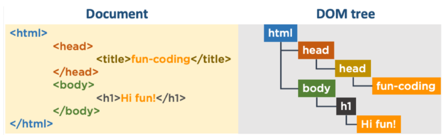
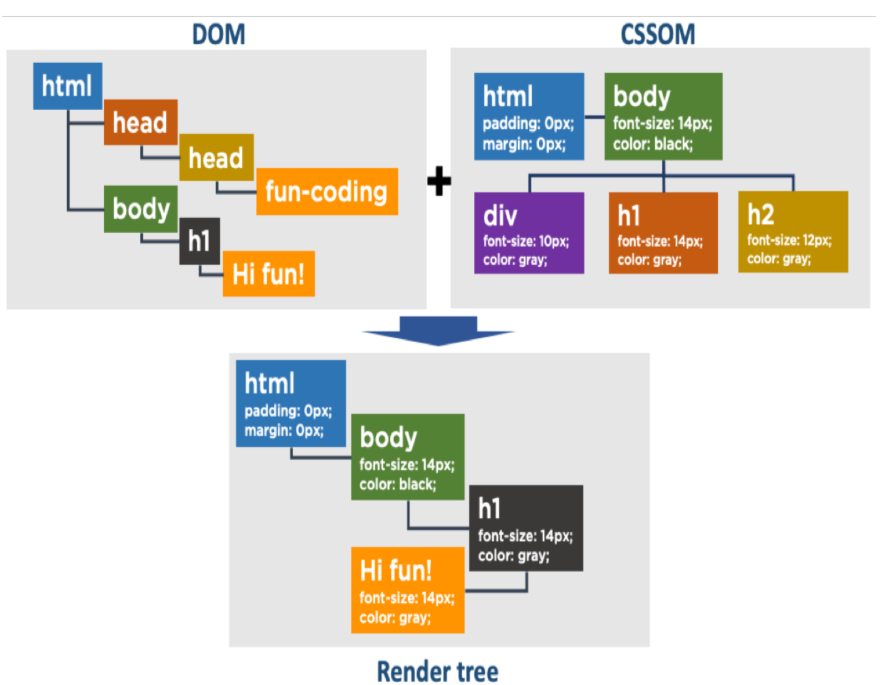

# 2 Javascript(Vanilla JS)

## 2.1 Table of Contents
- [2 Javascript(Vanilla JS)](#2-javascriptvanilla-js)
  - [2.1 Table of Contents](#21-table-of-contents)
  - [2.2 Section9. Javascript(Vanilla JS) 기본 지식과 변수/조건문](#22-section9-javascriptvanilla-js-기본-지식과-변수조건문)
    - [2.2.1 Javascript 기본](#221-javascript-기본)
      - [2.2.1.1 변수](#2211-변수)
      - [2.2.1.2 데이터 타입](#2212-데이터-타입)
        - [2.2.1.2.1 Number](#22121-number)
        - [2.2.1.2.2 Boolean](#22122-boolean)
        - [2.2.1.2.3 null과 undefined](#22123-null과-undefined)
        - [2.2.1.2.4 object](#22124-object)
        - [2.2.1.2.5 Symbol](#22125-symbol)
        - [2.2.1.2.6 데이터 타입 변환](#22126-데이터-타입-변환)
        - [2.2.1.2.7 주요 연산자](#22127-주요-연산자)
      - [2.2.1.3 조건문](#2213-조건문)
        - [2.2.1.3.1 if문](#22131-if문)
        - [2.2.1.3.2 switch/case 문](#22132-switchcase-문)
      - [2.2.1.4 함수](#2214-함수)
        - [2.2.1.4.1 함수 선언](#22141-함수-선언)
        - [2.2.1.4.2 ES6 화살표 함수Arrow function](#22142-es6-화살표-함수arrow-function)
  - [2.3 Section10. Javascript(Vanilla JS) 함수와 객체](#23-section10-javascriptvanilla-js-함수와-객체)
    - [2.3.1 객체 선언기법 이해](#231-객체-선언기법-이해)
      - [2.3.1.1 객체](#2311-객체)
        - [2.3.1.1.1 객체 생성 방법](#23111-객체-생성-방법)
        - [2.3.1.1.2 객체 리터럴 사용시 주의사항](#23112-객체-리터럴-사용시-주의사항)
        - [2.3.1.1.3 getter / setter](#23113-getter--setter)
      - [2.3.1.2 ⭐️ES6 클래스](#2312-️es6-클래스)
        - [2.3.1.2.1 정의](#23121-정의)
        - [2.3.1.2.2 상속](#23122-상속)
        - [2.3.1.2.3 `hasOwnProperty()` 사용법](#23123-hasownproperty-사용법)
  - [2.4 Section11. Javascript(Vanilla JS) 반복문/배열](#24-section11-javascriptvanilla-js-반복문배열)
    - [2.4.1 for문](#241-for문)
      - [2.4.1.1 배열과 for문](#2411-배열과-for문)
      - [2.4.1.2 객체와 for문](#2412-객체와-for문)
        - [2.4.1.2.1 `for ..in` : 객체의 키를 반복](#24121-for-in--객체의-키를-반복)
        - [2.4.1.2.2 객체(딕셔너리)의 키와 값을 반복](#24122-객체딕셔너리의-키와-값을-반복)
    - [2.4.2 while문](#242-while문)
    - [2.4.3 break와 continue](#243-break와-continue)
    - [2.4.4 javascript 배열](#244-javascript-배열)
      - [2.4.4.1 CRUD](#2441-crud)
        - [2.4.4.1.1 배열 생성(CREATE)](#24411-배열-생성create)
        - [2.4.4.1.2 배열 읽기(READ)](#24412-배열-읽기read)
        - [2.4.4.1.3 배열 수정(UPDATE)](#24413-배열-수정update)
        - [2.4.4.1.4 배열 삭제(DELETE)](#24414-배열-삭제delete)
      - [2.4.4.2 다양한 배열 관련 기능(함수)](#2442-다양한-배열-관련-기능함수)
        - [2.4.4.2.1 `push()` - 배열의 끝에 요소 추가](#24421-push---배열의-끝에-요소-추가)
        - [2.4.4.2.2 `pop()` - 끝의 아이템을 반환 후 배열에서 삭제](#24422-pop---끝의-아이템을-반환-후-배열에서-삭제)
        - [2.4.4.2.3 `shift()` - 배열의 첫번째 아이템을 반환 후 삭제](#24423-shift---배열의-첫번째-아이템을-반환-후-삭제)
        - [2.4.4.2.4 `concat()` - 배열 합치기](#24424-concat---배열-합치기)
        - [2.4.4.2.5 `join(item)` - 배열을 문자열로 변환](#24425-joinitem---배열을-문자열로-변환)
        - [2.4.4.2.6 `reverse()` - 배열의 순서 뒤집기](#24426-reverse---배열의-순서-뒤집기)
        - [2.4.4.2.7 `slice(start, end)` - 배열의 일부를 잘라내기](#24427-slicestart-end---배열의-일부를-잘라내기)
        - [2.4.4.2.8 `forEach()` - 배열의 각 요소에 대해 함수를 실행](#24428-foreach---배열의-각-요소에-대해-함수를-실행)
        - [2.4.4.2.9 `map()` - 배열의 각 요소에 대해 함수를 실행하고 새로운 배열 반환](#24429-map---배열의-각-요소에-대해-함수를-실행하고-새로운-배열-반환)
        - [2.4.4.2.10 `indexOf()` - 배열에서 특정 요소의 인덱스 찾기](#244210-indexof---배열에서-특정-요소의-인덱스-찾기)
        - [2.4.4.2.11 `findIndex()` - 배열에서 특정 요소의 인덱스 찾기](#244211-findindex---배열에서-특정-요소의-인덱스-찾기)
        - [2.4.4.2.12 `find()` - 배열에서 특정 요소 찾기](#244212-find---배열에서-특정-요소-찾기)
        - [2.4.4.2.13 `filter()` - 배열에서 특정 조건을 만족하는 요소들로 새로운 배열 생성](#244213-filter---배열에서-특정-조건을-만족하는-요소들로-새로운-배열-생성)
  - [2.5 Section12. Javascript(Vanilla JS) 중급](#25-section12-javascriptvanilla-js-중급)
    - [2.5.1 삼항 연산자](#251-삼항-연산자)
    - [2.5.2 함수의 기본 인자(파라미터) 값 설정 - 디폴트값 설정](#252-함수의-기본-인자파라미터-값-설정---디폴트값-설정)
    - [2.5.3 구조 분해 할당(비구조화 할당) 문법](#253-구조-분해-할당비구조화-할당-문법)
    - [2.5.4 배열 분해 할당](#254-배열-분해-할당)
    - [2.5.5 유용한 구조 분해 할당 문법 활용 팁](#255-유용한-구조-분해-할당-문법-활용-팁)
      - [2.5.5.1 변수값 교환](#2551-변수값-교환)
      - [2.5.5.2 함수 리턴 시 여러 데이터 넘겨주기](#2552-함수-리턴-시-여러-데이터-넘겨주기)
      - [2.5.5.3 문자열 분리해서 각각의 변수에 대입](#2553-문자열-분리해서-각각의-변수에-대입)
    - [2.5.6 Rest 파라미터](#256-rest-파라미터)
    - [2.5.7 Spread 연산자](#257-spread-연산자)
    - [2.5.8 호이스팅(Hoisting) 이슈와 해결방법](#258-호이스팅hoisting-이슈와-해결방법)
      - [2.5.8.1 var 키워드](#2581-var-키워드)
      - [2.5.8.2 해결방안](#2582-해결방안)
    - [2.5.9 scope](#259-scope)
      - [2.5.9.1 `let`과 `const`의 블록 스코프](#2591-let과-const의-블록-스코프)
      - [2.5.9.2 var 키워드와 함수 스코프](#2592-var-키워드와-함수-스코프)
      - [2.5.9.3 전역변수와 지역변수](#2593-전역변수와-지역변수)
    - [2.5.10 동기 / 비동기 처리 이해](#2510-동기--비동기-처리-이해)
      - [2.5.10.1 동기적 처리와 비동기적 처리](#25101-동기적-처리와-비동기적-처리)
        - [2.5.10.1.1 주요 비동기적 처리](#251011-주요-비동기적-처리)
      - [2.5.10.2 비동기 처리 예(setTimeout 함수)](#25102-비동기-처리-예settimeout-함수)
      - [2.5.10.3 콜백 함수 설정](#25103-콜백-함수-설정)
      - [2.5.10.4 콜백 지옥](#25104-콜백-지옥)
      - [2.5.10.5 해결방법](#25105-해결방법)
    - [2.5.11 Promise](#2511-promise)
      - [2.5.11.1 Promise 3가지 상태](#25111-promise-3가지-상태)
      - [2.5.11.2 `then` 메서드](#25112-then-메서드)
      - [2.5.11.3 `catch` 메서드](#25113-catch-메서드)
      - [2.5.11.4 `throw` 메서드](#25114-throw-메서드)
      - [2.5.11.5 `chaining`과 `return`](#25115-chaining과-return)
      - [2.5.11.6 `finally` 메서드](#25116-finally-메서드)
      - [2.5.11.7 `Promise.all()`](#25117-promiseall)
      - [2.5.11.8 `Promise.race`](#25118-promiserace)
  - [2.6 Section13. DOM / BOM 이해](#26-section13-dom--bom-이해)
    - [2.6.1 DOM(Document Object Model)](#261-domdocument-object-model)
      - [2.6.1.1 웹브라우저 동작 과정](#2611-웹브라우저-동작-과정)
      - [2.6.1.2 javascript 코드 삽입 위치](#2612-javascript-코드-삽입-위치)
      - [2.6.1.3 window와 Document](#2613-window와-document)
      - [2.6.1.4 window 와 BOM(Browser Object Model)](#2614-window-와-bombrowser-object-model)
    - [2.6.2 document CRUD(Create, Read(Find), Update, Delete)](#262-document-crudcreate-readfind-update-delete)
      - [2.6.2.1 조작이 필요한 HTML 찾기(Read)](#2621-조작이-필요한-html-찾기read)
      - [2.6.2.2 찾은 HTML 요소 확인/수정하기(Update)](#2622-찾은-html-요소-확인수정하기update)
      - [2.6.2.3 HTML 요소 생성/추가하기(Create)](#2623-html-요소-생성추가하기create)
      - [2.6.2.4 HTML 요소 삭제하기(Delete)](#2624-html-요소-삭제하기delete)
      - [2.6.2.5 HTML 요소 탐색](#2625-html-요소-탐색)
    - [2.6.3 이벤트](#263-이벤트)
      - [2.6.3.1 이벤트 등록](#2631-이벤트-등록)
  - [2.7 Section14. 모던 웹페이지 제작(Vanilla JS)](#27-section14-모던-웹페이지-제작vanilla-js)
    - [2.7.1 back to top 기능](#271-back-to-top-기능)
      - [2.7.1.1 FontAwesome 아이콘 적용 방법](#2711-fontawesome-아이콘-적용-방법)
      - [3.1 CSS 코드](#31-css-코드)
      - [4.1 HTML5에서 변수값을 표기하는 방법](#41-html5에서-변수값을-표기하는-방법)
      - [4.2 IE11과의 호환성 해결](#42-ie11과의-호환성-해결)
  
<hr>

## 2.2 Section9. Javascript(Vanilla JS) 기본 지식과 변수/조건문
> - 📕PDF
>     - [x] [17_js_start](https://drive.google.com/file/d/1jGURRlNtfe6Cl_WjrvUsClppfyKtggpW/view?usp=sharing "17_js_start.pdf")
>     - [x] [18_js_basic](https://drive.google.com/file/d/18aN1dtpsAF6EohbSIL0wABJDd2urWIU3/view?usp=sharing "18_js_basic.pdf")
<!-- > - 🧪실습파일
>  - [x] [css_inheritance](https://codesandbox.io/p/sandbox/cssinheritance-uhyym?file=%2Fsrc%2Findex.js%3A1%2C1-2%2C1 "Go to url") -->

### 2.2.1 Javascript 기본
#### 2.2.1.1 변수
```javascript
// 변수 선언
let a = 1; // 변수 선언
const b = 2; // 상수 선언
var c = 3; // 전역 스코프
```
> - `let` : 두번 이상 선언 불가능, 재할당 가능

#### 2.2.1.2 데이터 타입
##### 2.2.1.2.1 Number
- 정수/부동소숫점을 통째로 `Number` 데이터 타입으로 처리


##### 2.2.1.2.2 Boolean
- `true` 또는 `false`로 표현

```javascript
let isTrue = true;
let isFalse = false;
```

##### 2.2.1.2.3 null과 undefined
- `null` : 의도적으로 비어있음을 표현
- `undefined` : 변수가 선언되었지만 값이 할당되지 않음
- <u>null과 undefined</u> 는 **다른 데이터 타입으로 취급**됨

```javascript
let a = null; // 의도적으로 비어있음
let b; // 값이 할당되지 않음

console.log(typeof a, a); // object null
console.log(typeof b); // undefined
```

##### 2.2.1.2.4 object
- 객체 타입을 나타내는 데이터 타입

##### 2.2.1.2.5 Symbol
- ES6에서 추가된 데이터 타입으로, 고유한 식별자를 생성하는데 사용
- 주로 객체의 프로퍼티 키로 사용됨

```javascript
let sym1 = Symbol('description');
let sym2 = Symbol('description');
console.log(sym1 === sym2); // false
```

> == : 값만 비교
> === : 값과 타입 모두 비교

##### 2.2.1.2.6 데이터 타입 변환
1. `Number()` : 숫자형으로 변환
2. `parseInt()` : 정수형으로 변환
3. `parseFloat()` : 부동소수점형으로 변환
4. `String()` : 문자열로 변환
5. `Boolean()` : 불리언형으로 변환

##### 2.2.1.2.7 주요 연산자
1. 동등 연산자(`==`) vs 일치 연산자(`===`)
- `==, !=` : 관대한 연산자, 기본적으로 값만 같은지 확인
- `===, !==` : 엄격한 연산자, 값과 타입 모두 같은지 확인
```javascript
console.log(1 == '1'); // true
console.log(1 === '1'); // false
```

2. ++ 연산자
- `변수++` : 변수에서 먼저 값을 꺼내고, 그 다음에 1을 더함
- `++변수` : 변수 값에 1을 더한 값을 꺼냄
```javascript
let a = 1;
let b = 1;
console.log(a++); // 1
console.log(++b); // 2
```

3. 대입 연산자
- `=` : 변수에 값을 대입
- `+=` : 변수에 값을 더한 후 대입
```javascript
let a = 1;
let b = 2;
a += b;
console.log(a); // 3
```

4. 논리 연산자
- `&&` : AND 연산자, 둘 다 true일 때 true
- `||` : OR 연산자, 둘 중 하나라도 true일 때 true
- `!` : NOT 연산자, true를 false로, false를 true로 변환
```javascript
let a = true;
let b = false;
console.log(a && b); // false
console.log(a || b); // true
console.log(!a); // false
```

5. 문자열 연산자
- `+` : 문자열을 연결
- `+=` : 문자열을 연결한 후 대입
```javascript
let a = 'Hello';
let b = 'World';
console.log(a + ' ' + b); // Hello World
a += ' ' + b;
console.log(a); // Hello World
```

#### 2.2.1.3 조건문
##### 2.2.1.3.1 if문
```javascript
if (조건) {
    // 조건이 true일 때 실행할 코드
} else if (조건) {
    // 조건이 true일 때 실행할 코드
} else {
    // 모든 조건이 false일 때 실행할 코드
}
```

##### 2.2.1.3.2 switch/case 문
```javascript
switch (변수) {
    case 값1:
        // 변수와 값1이 같을 때 실행할 코드
        break;
    case 값2:
        // 변수와 값2가 같을 때 실행할 코드
        break;
    default:
        // 모든 case가 false일 때 실행할 코드
}
```
> **case 문에서 break를 사용하지 않으면, 다음 case 문 및 default 문이 실행됨**

#### 2.2.1.4 함수
##### 2.2.1.4.1 함수 선언

```javascript
function 함수이름(매개변수) {
    // 함수 내용
    return 반환값;
}
```

##### 2.2.1.4.2 ES6 화살표 함수<sup>Arrow function</sup>
```javascript
let func = (매개변수) => expression;
```

<hr>

## 2.3 Section10. Javascript(Vanilla JS) 함수와 객체
### 2.3.1 객체 선언기법 이해
> - 📕PDF
>  - [x] [19_js_basic_object](https://drive.google.com/file/d/1lZ_UwbNSmmqMojCcFnu6jO7K7Xj28TMb/view?usp=sharing "19_js_basic_object.pdf")

#### 2.3.1.1 객체
- 객체 생성방법 
    - 객체 리터럴
    - new Object()로 생성
    - 생성자 함수로 생성하는 방식
- 객체이름 선언시에는 보통 `const` 사용

##### 2.3.1.1.1 객체 생성 방법

1. 객체 리터럴

    ```javascript
    const obj = {
    key1: 1,
    key2: 2,
    key3: 3,
    get_data: function () {
        return this.key1 + this.key2 + this.key3;
    },
    };

    console.log(obj.get_data());
    ```

2. new Object()로 생성
    ```javascript
    const obj = new Object();
    obj.key1 = 1;
    obj.key2 = 2;
    obj.key3 = 3;
    obj.get_data = function () {
        return this.key1 + this.key2 + this.key3;
    };
    console.log(obj.get_data());
    ```

3. 생성자 함수로 생성하는 방식
    ```javascript
    function Obj(key1, key2, key3) {
        this.key1 = key1;
        this.key2 = key2;
        this.get_data = function () {
            return this.key1 + this.key2;
        };
    }

    const obj = new Obj(1, 2);
    console.log(obj.get_data());
    ```

##### 2.3.1.1.2 객체 리터럴 사용시 주의사항

1. `this` 키워드
- 객체 내부에서 자기 자신을 가리키는 키워드

2. arrow function 안에서 `this`는 사용 불가

##### 2.3.1.1.3 getter / setter
1. 사용방법
    - getter는 선언시 인자가 없어야하고, setter는 인자가 반드시 하나 이상 있어야 함

    ```javascript
    const obj = {
    key1: 1,
    key2: 2,

    get data() {
        return this.key1 + this.key2;
    },
    set data(value) {
        this.key1 = value;
    },
    };
    ```

#### 2.3.1.2 ⭐️ES6 클래스

##### 2.3.1.2.1 정의
- `constructor` 에 속성값 추가(python의 `__init__`과 유사)

```javascript
class ClassName {
    constructor(key1, key2) {
        this.key1 = key1;
        this.key2 = key2;
    }
    get_data() {
        return this.key1 + this.key2;
    }
}
const obj = new ClassName(1, 2);
console.log(obj.get_data());  // 3
```

##### 2.3.1.2.2 상속

- `extends` 키워드를 사용하여 부모 클래스를 상속받음
- `super()` 키워드를 사용하여 부모 클래스의 생성자를 호출함(constructor 안에서 호출해야 함)

```javascript
class Parent {
    constructor(key1, key2) {
        this.key1 = key1;
        this.key2 = key2;
    }
    get_data() {
        return this.key1 + this.key2;
    }
}
class Child extends Parent {
    constructor(key1, key2, key3) {
        super(key1, key2);
        this.key3 = key3;
    }
    get_data() {
        return super.get_data() + this.key3;
    }
}
```

##### 2.3.1.2.3 `hasOwnProperty()` 사용법
- 프로퍼티가 객체에서 정의된 것인지 확인하는 메소드

```javascript
class Animal {
  constructor(name) {
    this.name = name;
  }

  get_message() {
    return `Hello, I am ${this.name}`;
  }
}

Animal.prototype.age = 10;

const animal = new Animal("Dog");
console.log(animal.hasOwnProperty("name")); // true
console.log(animal.hasOwnProperty("age")); // false
```

<hr>

## 2.4 Section11. Javascript(Vanilla JS) 반복문/배열

### 2.4.1 for문
> - 📕PDF
>  - [x] [20_js_repeat.pdf](https://drive.google.com/file/d/1vGCoMuHOXQ1skmTWM8qXoCpv7wr280Ar/view?usp=sharing "20_js_repeat.pdf")

```javascript
for (초기문; 조건문; 증감문) {
    // 반복할 코드
}
```

- 초기문 : let i=0;
- 조건문 : i<10;
- 증감문 : i++;

```javascript
for (let i = 0; i < 10; i++) {
    console.log(i);
}
```

#### 2.4.1.1 배열과 for문
1. `length` 사용

    ```javascript
    const arr = ['first', 'second', 'third'];
    for (let i = 0; i < arr.length; i++) {
        console.log(arr[i]);
    }  // => first second third
    ```

2. `for ..of` 사용
    ```javascript
    const arr = ['first', 'second', 'third'];
    for (const item of arr) {
        console.log(item);
    }  // => first second third
    ```

#### 2.4.1.2 객체와 for문
##### 2.4.1.2.1 `for ..in` : 객체의 키를 반복
```javascript
const obj = {
    key1: 'value1',
    key2: 'value2',
    key3: 'value3',
};
for (const key in obj) {
    console.log(key, obj[key]);
}  // => key1 value1 key2 value2 key3 value3
```

##### 2.4.1.2.2 객체(딕셔너리)의 키와 값을 반복
- `Object.entries()` : 객체의 키와 값을 배열로 반환
- `Object.keys()` : 객체의 키를 배열로 반환
- `Object.values()` : 객체의 값을 배열로 반환

```javascript
const obj = {
    key1: 'value1',
    key2: 'value2',
    key3: 'value3',
};
console.log(Object.entries(obj)); // => [['key1', 'value1'], ['key2', 'value2'], ['key3', 'value3']]
console.log(Object.keys(obj)); // => ['key1', 'key2', 'key3']
console.log(Object.values(obj)); // => ['value1', 'value2', 'value3']
```

### 2.4.2 while문
```javascript
let i = 0;
while (i < 10) {
    console.log(i);
    i++;
}
```

### 2.4.3 break와 continue
- `break` : 반복문을 종료
- `continue` : 현재 반복을 건너뛰고 다음 반복으로 넘어감

```javascript
for (let i = 0; i < 10; i++) {
    if (i === 5) {
        break; // 5에서 반복문 종료
    }
    console.log(i);
}
for (let i = 0; i < 10; i++) {
    if (i === 5) {
        continue; // 5에서 반복 건너뛰고 다음 반복으로 넘어감
    }
    console.log(i);
}
```

### 2.4.4 javascript 배열
> - 📕PDF
>  - [x] [20_js_array.pdf](https://drive.google.com/file/d/1O2pKEpFRg3psbb80xuqn_C4vb4ouVFwo/view?usp=sharing "20_js_array.pdf")

#### 2.4.4.1 CRUD
##### 2.4.4.1.1 배열 생성(CREATE)
```javascript
// 배열 생성(일반적)
const arr = [1, 2, 'string', true, null];

// 배열의 길이  
arr.length; 

// 아래와 같이 배열을 생성할 수 있음 - 배열 안의 각 인덱스에 직접 할당
const arr2 = new Array();
arr2[1] = 1;
arr2[2] = 2;
console.log(arr2); // [empty, 1, 2]
```

##### 2.4.4.1.2 배열 읽기(READ)
```javascript
console.log(arr[0], arr[arr.length - 1]);
```

##### 2.4.4.1.3 배열 수정(UPDATE)
```javascript   
arr[0] = 100;
```

##### 2.4.4.1.4 배열 삭제(DELETE)
- `splice(삭제할 인덱스, 삭제할 개수)`
```javascript
const data = [1, 2, 3, "kang", "hwan"];
console.log(data);  // [ 1, 2, 3, 'kang', 'hwan' ]
data.splice(3, 100);
console.log(data);  // [ 1, 2, 3 ]
```

#### 2.4.4.2 다양한 배열 관련 기능(함수)
##### 2.4.4.2.1 `push()` - 배열의 끝에 요소 추가  
```javascript
const arr = [1, 2, 3];
arr.push(4); // [1, 2, 3, 4]
```
##### 2.4.4.2.2 `pop()` - 끝의 아이템을 반환 후 배열에서 삭제
```javascript
const arr = [1, 2, 3];
arr.pop(); // [1, 2]
```

##### 2.4.4.2.3 `shift()` - 배열의 첫번째 아이템을 반환 후 삭제
```javascript
const arr = [1, 2, 3];
arr.shift(); // [2, 3]
```

##### 2.4.4.2.4 `concat()` - 배열 합치기
```javascript 
const arr1 = [1, 2, 3];
const arr2 = [4, 5, 6];
const arr3 = arr1.concat(arr2); // [1, 2, 3, 4, 5, 6]
```

##### 2.4.4.2.5 `join(item)` - 배열을 문자열로 변환
```javascript
const arr = [1, 2, 3];
const str = arr.join(", "); // "1, 2, 3"
```

##### 2.4.4.2.6 `reverse()` - 배열의 순서 뒤집기
```javascript
const arr = [1, 2, 3];
arr.reverse(); // [3, 2, 1]
```

##### 2.4.4.2.7 `slice(start, end)` - 배열의 일부를 잘라내기
```javascript
const arr = [1, 2, 3, 4, 5];
arr.slice(1, 3); // [2, 3]
```

##### 2.4.4.2.8 `forEach()` - 배열의 각 요소에 대해 함수를 실행
```javascript   
const arr = ['first', 'second', 'third'];
arr.forEach((item, index) => {
    console.log(item, index);
});
// first 0 second 1 third 2 
```

##### 2.4.4.2.9 `map()` - 배열의 각 요소에 대해 함수를 실행하고 새로운 배열 반환
```javascript
const arr = [1, 2, 3];
const newArr = arr.map(item => item * 2);

console.log(newArr); // [2, 4, 6]
```

##### 2.4.4.2.10 `indexOf()` - 배열에서 특정 요소의 인덱스 찾기
```javascript
const arr = ['first', 'second', 'third'];   
arr.indexOf('second'); // 1
```

##### 2.4.4.2.11 `findIndex()` - 배열에서 특정 요소의 인덱스 찾기
```javascript
const myArray = [
  {
    name: "John",
    age: 25,
  },
  {
    name: "Jane",
    age: 30,
  },
];

console.log(myArray.indexOf("John")); // -1
console.log(myArray.findIndex((item) => item.name === "John")); // 0
```

##### 2.4.4.2.12 `find()` - 배열에서 특정 요소 찾기
```javascript
console.log(myArray.find((item) => item.name === "John")); // { name: 'John', age: 25 }
```

##### 2.4.4.2.13 `filter()` - 배열에서 특정 조건을 만족하는 요소들로 새로운 배열 생성
```javascript
const arr = [1, 2, 3, 4, 5];
let odd = arr.filter((item) => item % 2 === 1); // [1, 3, 5]
let even = arr.filter((item) => item % 2 === 0); // [2, 4]
```

<hr>

## 2.5 Section12. Javascript(Vanilla JS) 중급
> - 📕PDF
>  - [x] [22_js_plus.pdf](https://drive.google.com/file/d/13TjITewVzKFLAPAtr0UwmPHF8uuW46bg/view?usp=drive_link "22_js_plus.pdf")
>  - [x] [23_js_process.pdf](https://drive.google.com/file/d/15xJyjI0b3blxga6Ccy4xHu-mPaNgpfC1/view?usp=drive_link "23_js_process.pdf")

### 2.5.1 삼항 연산자
- 문법 : `condition ? true : false`

```javascript
let a = 1;
let b = 2;
let result = a > b ? "a가 b보다 큽니다." : "b가 a보다 큽니다.";
console.log(result); // b가 a보다 큽니다.
```

### 2.5.2 함수의 기본 인자(파라미터) 값 설정 - 디폴트값 설정
- ES6에서 추가된 기능으로, 함수의 인자에 기본값을 설정할 수 있음

```javascript
function add(a, b = 0) {
    return a + b;
}
console.log(add(1)); // 1
console.log(add(1, 2)); // 3
```

### 2.5.3 구조 분해 할당(비구조화 할당) 문법

```javascript
const data = {
  key1: "value1",
  key2: "value2",
  key3: "value3",
};

let { key1, key2, key3 } = data;
console.log(key1, key2, key3); // Output: value1 value2 value3

// Using destructuring assignment to extract values from an object
let { key1: newKey1, key2: newKey2, key3: newKey3 } = data; 
console.log(newKey1, newKey2, newKey3); // Output: value1 value2 value3
```

### 2.5.4 배열 분해 할당

```javascript       
const arr = [1, 2, 3, 4, 5];
let [first, second, ...rest] = arr;
console.log(first, second, rest); // Output: 1 2 [3, 4, 5]  
```

### 2.5.5 유용한 구조 분해 할당 문법 활용 팁
#### 2.5.5.1 변수값 교환
```javascript   
[a, b] = [b, a];
```

#### 2.5.5.2 함수 리턴 시 여러 데이터 넘겨주기
```javascript
function getData() {
    return [1, 2, 3];
}
let [a, b, c] = getData();
```

#### 2.5.5.3 문자열 분리해서 각각의 변수에 대입
```javascript
const str = "Cha KangHwan";
const [firstName, lastName] = str.split(" ");   
```

### 2.5.6 Rest 파라미터
- Rest 파라미터는 함수의 인자 개수가 정해지지 않았을 때 사용
- `...`을 사용하여 나머지 인자를 배열로 받을 수 있음

```javascript
function add(...rest) {
    ...
}
```

### 2.5.7 Spread 연산자
- Spread 연산자는 배열이나 객체를 펼쳐서 새로운 배열이나 객체를 생성할 때 사용

```javascript
const arr1 = [1, 2, 3];
const arr2 = [4, 5, 6];
const arr3 = [...arr1, ...arr2]; // [1, 2, 3, 4, 5, 6]
```

> `concat`과는 다르게, 배열의 중간에도 넣을 수 있음

```javascript
const arr1 = [1, 2, 3];
const arr2 = [4, 5, 6];
const arr3 = [0, ...arr1, 7, ...arr2]; // [0, 1, 2, 3, 7, 4, 5, 6]
```

### 2.5.8 호이스팅(Hoisting) 이슈와 해결방법
> - 📕PDF
>  - [x] [23_js_process.pdf](https://drive.google.com/file/d/15xJyjI0b3blxga6Ccy4xHu-mPaNgpfC1/view?usp=drive_link "23_js_process.pdf")

- 호이스팅(hoisting)은 자바스크립트의 실행 컨텍스트에서 변수와 함수의 선언이 해당 스코프의 최상단으로 끌어올려지는 현상
    > **즉, 변수 선언전에 변수를 사용해도 에러가 발생하지 않음**

#### 2.5.8.1 var 키워드
- `var` 키워드로 선언된 변수는 호이스팅이 발생함 
    - `let`과는 다르게, 변수를 선언하기 전에 사용할 수 있음
    - **코드 오류가 발생**할 수 있기 때문에, `let`과 `const`를 사용하는 것이 좋음

- 내부적으로 **javascript**는 **함수와 변수 선언 부분만 분리**해서 최상단으로 끌어올림

    ```javascript
    console.log(a); // undefined
    var a = 1;
    ```

#### 2.5.8.2 해결방안
1. `let`과 `const` 사용(`var` 사용 지양)

2. 함수 선언의 경우 *함수 선언문*이 아닌, **함수 표현식**으로 사용할 것
```javascript   
// 함수 선언문 🚫
function func() {
    console.log("Hello");
}
```
```javascript
// 함수 표현식 🟢
const func = function() {
    console.log("Hello");
}
```

### 2.5.9 scope
- 변수 또는 함수가 유효한 범위
    1. Global scope : 전역 범위
    2. Function scope : 함수 범위
    3. Block scope : 블록 범위

#### 2.5.9.1 `let`과 `const`의 블록 스코프
- `let`과 `const`로 선언된 변수는 블록 스코프를 가짐
- 즉, 해당 변수가 선언된 블록({}) 내에서만 유효함

```javascript
{
  let a = 1;
  {
    console.log(a); // 블록 안의 블록에서는 유효함
  }
}

console.log(a);  // ReferenceError: a is not defined
```

#### 2.5.9.2 var 키워드와 함수 스코프
- 함수 안은 `var` 로 선언된 변수는 함수 스코프를 가짐
- **블록 안의 `var`로 선언된 변수는 함수 밖에서도 사용 가능함**

#### 2.5.9.3 전역변수와 지역변수 
- 동일한 이름을 가진 변수를 전역과 지역에서 선언할 경우, **지역변수가 우선시** 됨

### 2.5.10 동기 / 비동기 처리 이해
> - 📕PDF
>   - [x] [24_js_promise.pdf](https://drive.google.com/file/d/1Wu7rxtgdROQW1po2eyCG4Wh2CL5HxggA/view?usp=drive_link "24_js_promise.pdf")

#### 2.5.10.1 동기적 처리와 비동기적 처리 
- Synchronous(동기) : 요청을 보낸 후, 해당 요청의 응답을 받아야 다음 동작을 실행
- Asynchronous(비동기) : 요청을 보낸 후, 응답과 관계없이 다음 동작을 실행

##### 2.5.10.1.1 주요 비동기적 처리
> 오래 걸리는 기능은 비동기적으로 처리됨
- Rest API 요청
- 파일/데이터베이스 처리
- 타이머, 암호화/복호화 등

#### 2.5.10.2 비동기 처리 예(setTimeout 함수)
- `setTimeout()` : 일정 시간 후에 함수를 실행하는 메소드

    ```javascript
    setTimeout(function, miliseconds);
    ```
    - miliseconds : 대기 시간(밀리초 단위)
    - function : ms만큼 기다린 후, 호출할 함수

#### 2.5.10.3 콜백 함수 설정
- 비동기 처리에서 일어날 수 있는 오류를 방지하기 위해, **콜백 함수**를 사용하여 비동기 처리를 수행함
- 자바스크립트에서 함수는 first-class function

```javascript
function func1(callback) {
    setTimeout(() => {
        console.log("func1");
        callback();
    }, 1000);
}

function func2() {
    console.log("func2");
}
func1(func2); // func1 func2
```
- func1에 func2를 콜백으로 넘기고, setTimeout이 끝나면 func2를 실행함

#### 2.5.10.4 콜백 지옥
- 콜백 함수를 중첩하여 사용하게 되면, 가독성이 떨어지고 유지보수가 어려워짐 
- 이를 **콜백 지옥**이라고 함


#### 2.5.10.5 해결방법 
- `Promise`, `async/await`를 사용하여 비동기 처리를 수행함
- `async/await`는 ES8에서 추가된 기능으로, 호환성을 확인해봐야 함

### 2.5.11 Promise 
- ES6에서 공식적으로 추가된 문법, 비동기 처리를 위한 콜백함수의 단점을 극복하기 위해 제안됨

1. `new Promise()` 생성자 함수로 Promise 객체를 생성
2. `resolve`와 `reject`를 인자로 받아 비동기 처리 함수를 실행
3. `excutor` 함수에서 비동기 처리가 성공하면 `resolve`를 호출하고, 실패하면 `reject`를 호출

```javascript
const myPromise = new Promise((resolve, reject) => {
    // 비동기 처리
    if (성공) {
        resolve(결과);
    } else {
        reject(오류);
    }
});
```

#### 2.5.11.1 Promise 3가지 상태 
1. Pending(대기) : 비동기 처리가 진행 중인 상태
2. Fulfilled(이행) : 비동기 처리가 성공적으로 완료된 상태
3. Rejected(거부) : 비동기 처리가 실패한 상태

#### 2.5.11.2 `then` 메서드 
```javascript
promise.then(successCallback, failureCallback);
``` 

#### 2.5.11.3 `catch` 메서드
- 예외상황을 처리함

#### 2.5.11.4 `throw` 메서드
- 사용자 정의 예외를 발생시킴
    - catch블록이 있으면 catch블록으로 전달, 그렇지 않으면 프로그램 종료
    ```javascript
    throw new Error("Error message");
    ```

#### 2.5.11.5 `chaining`과 `return`
- chaining : then() 메서드를 연속으로 호출하는 것
- return : then() 메서드에서 반환된 값을 다음 then() 메서드에서 사용할 수 있음

```javascript
const myPromise = new Promise((resolve, reject) => {
    setTimeout(() => {
        resolve("Success");
    }, 1000);
});
myPromise
    .then((result) => {
        console.log(result); // Success
        return "Next Success";
    })
    .then((result) => {
        console.log(result); // Next Success
    })
    .catch((error) => {
        console.error(error);
    });
```

#### 2.5.11.6 `finally` 메서드   
- Promise의 상태(resolve 또는 reject)와 관계없이 항상 실행되는 메서드

#### 2.5.11.7 `Promise.all()`
- 동기화 처리할 Promise를 묶어서 한번에 실행
- 여러 함수가 다 실행이 완료된 후에, then 구문을 실행

```javascript
Promise.all([promise1, promise2, promise3])
    .then((results) => {
        console.log(results); // [result1, result2, result3]
    })
    .catch((error) => {
        console.error(error);
    });
```

#### 2.5.11.8 `Promise.race`
- 여러 개의 Promise 중에서 가장 먼저 완료된 Promise의 결과를 반환
```javascript
Promise.race([promise1, promise2, promise3])
    .then((result) => {
        console.log(result); // 가장 먼저 완료된 Promise의 결과
    })
    .catch((error) => {
        console.error(error);
    });
```

## 2.6 Section13. DOM / BOM 이해
> - 📕PDF
>  - [x] [25_js_dom](https://drive.google.com/file/d/1-8bNOIQQh5Es4hUFIwvAvhXz2owLHtJJ/view?usp=sharing "25_js_dom.pdf")

### 2.6.1 DOM(Document Object Model) 
- Document: 구조화된 데이터
- DOM : 구조화된 문서를 객체로 표현한 것

<p style="text-align:;">
    
</p>

#### 2.6.1.1 웹브라우저 동작 과정
1. HTML 파일 가져오기
    - 보통 HTML 파일은 웹서버로부터 가져옴
2. HTML파일을 파싱(parsing)하여 DOM tree 생성, CSS 정보를 파싱하여 CSSOM tree 생성
3. DOM/CSSOM tree를 결합하여 Render tree 생성

<p style="text-align:;">
    
</p>

#### 2.6.1.2 javascript 코드 삽입 위치
- `</body>` 태그 바로 위에 삽입하는 것이 좋음

#### 2.6.1.3 window와 Document  
- window: 웹브라우저 객체
- document: DOM 객체

#### 2.6.1.4 window 와 BOM(Browser Object Model)
- `window`는 브라우저 환경 전체 객체를 가리키며, window를 생략할 수 있음
```javascript 
// 다음 두 코드는 동일함
alert("Hello");
window.alert("Hello");
```
- BOM의 주요 객체 
    - location : 현재 URL 정보
    - navigator : 브라우저 정보

    ``` javascript 
    console.log(window.location.href); // 현재 URL
    console.log(window.navigator.userAgent); // 브라우저 정보
    console.log(window.navigator.platform); // 운영체제 정보
    ```

### 2.6.2 document CRUD(Create, Read<sup>(Find)</sup>, Update, Delete)
> - 🧪실습파일
>   - [x] [js_dom](https://codesandbox.io/p/sandbox/jsdom-ihzmu?file=%2Fsrc%2Findex.js%3A1%2C1-2%2C1 "Go to url")

#### 2.6.2.1 조작이 필요한 HTML 찾기(Read)
| 메서드                              | 설명                        |
| ----------------------------------- | --------------------------- |
| `document.getElementById()`         | ID로 요소 찾기              |
| `document.getElementsByTagName()`   | 태그명으로 요소 찾기        |
| `document.getElementsByClassName()` | 클래스명으로 요소 찾기      |
| `document.querySelector()`          | CSS 선택자로 요소 찾기      |
| `document.querySelectorAll()`       | CSS 선택자로 여러 요소 찾기 |

#### 2.6.2.2 찾은 HTML 요소 확인/수정하기(Update)

| 프로퍼티                               | 설명                                 |
| -------------------------------------- | ------------------------------------ |
| `element.innerText = new html content` | 요소 내용 확인/수정하기(태그 미포함) |
| `element.innerHTML = new html content` | 요소 내용 확인/수정하기(태그 포함)   |
| `element.attribute = new value`        | 요소 attribute 값 수정하기           |
| `element.style.property = new style`   | 요소 CSS 속성 수정하기               |

#### 2.6.2.3 HTML 요소 생성/추가하기(Create)

| 메서드                            | 설명                        |
| --------------------------------- | --------------------------- |
| `document.createElement(tagName)` | 새로운 HTML 요소 생성하기   |
| `document.appendChild()`          | 요소를 부모 요소에 추가하기 |

- `document.createElement()`
    1. 요소 생성 
    2. 태그 속성 설정 
    3. CSS 속성 설정
    ```javascript
    <script>
      const newBox1 = document.createElement("div"); // HTML 요소 생성
      newBox1.innerText = "Kanghwan Cha";
      newBox1.setAttribute("class", "box1");
      newBox1.style.background = "#f2b441";
      document.body.appendChild(newBox1);
    </script>
    ```

#### 2.6.2.4 HTML 요소 삭제하기(Delete) 
| 메서드                           | 설명               |
| -------------------------------- | ------------------ |
| `element.removeChild(element)`   | 자식 요소 삭제하기 |
| `element.replaceChild(new, old)` | 자식 요소 교체하기 |

#### 2.6.2.5 HTML 요소 탐색
| 프로퍼티                         | 설명                   |
| -------------------------------- | ---------------------- |
| `element.parentNode`             | 부모 요소              |
| `element.nextElementSibling`     | 다음 형제 요소         |
| `element.previousElementSibling` | 이전 형제 요소         |
| `element.children`               | 자식 요소들(배열 형태) |

### 2.6.3 이벤트 
- 웹페이지에서 발생하는 이벤트를 의미

| 이벤트 이름 | 설명                                   |
| ----------- | -------------------------------------- |
| load        | 로드가 완료 되었을 때 발생             |
| resize      | 윈도우 크기가 변경되었을 때 발생       |
| keydown     | 키를 눌렀을 때 발생                    |
| keyup       | 키에서 손을 뗐을 때 발생               |
| change      | 변동이 있을 때 발생                    |
| **click**   | 클릭할 때 발생                         |
| **focus**   | 포커스를 얻었을 때 발생                |
| mousedown   | 마우스를 클릭 했을 때 발생             |
| mouseout    | 마우스가 객체 밖으로 나갔을 때 발생    |
| mouseover   | 마우스가 객체 위로 올라갔을 때 발생    |
| mousemove   | 마우스가 움직였을 때 발생              |
| mouseup     | 마우스에서 손을 뗐을 때 발생           |
| select      | option 태그 등에서 선택을 했을 때 발생 |

#### 2.6.3.1 이벤트 등록
- `addEventListener()` 메서드를 사용하여 이벤트를 등록함
```javascript 
EventTarget.addEventListener(`eventType`, functionName);
// EventTarget : 이벤트를 등록할 HTML 요소
// eventType : 이벤트 종류
// functionName : 이벤트 발생 시 실행할 함수
```

- `removeEventListener()` 메서드를 사용하여 이벤트를 제거함
```javascript
EventTarget.removeEventListener(`eventType`, functionName);
```

## 2.7 Section14. 모던 웹페이지 제작(Vanilla JS)
### 2.7.1 back to top 기능 
#### 2.7.1.1 FontAwesome 아이콘 적용 방법
```css
/* 아이콘 적용 방법
  1. ::after (요소 뒤에 content 추가) 가상 요소에서,
  2. content: "폰트어썸 유니코드"를 넣고, 
  3. font-family: FontAwesome 이라고 넣으면 됨
*/
# 3 acktotop::after {
  content: "\f077";
  font-family: FontAwesome;
  font-size: 1.5rem;
  line-height: 40px;
  color: #ffffff;
}
```

#### 3.1 CSS 코드
```css
# 4 acktotop {
  background-color: #968699;
  width: 40px;
  height: 40px;
  text-align: center;

  border-radius: 20px;
  position: fixed;
  bottom: 30px;
  right: 30px;
  transition-property: background-color, opacity, visibility;
  transition-duration: 0.3s, 0.5s, 0.5s;
  opacity: 0;
  visibility: hidden;
  z-index: 999;
}
```

#### 4.1 HTML5에서 변수값을 표기하는 방법

```html
<ul class="class-list" data-position="0">
```

#### 4.2 IE11과의 호환성 해결

1. Babel Standalone
    - 최신 JavaScript 코드를 구버전 JS로 변환해 실행
    - 개발용으로는 적합하나, **운영 환경(Production)**에서는 사용하지 않는 것이 좋음

    ```html
        <script src="https://cdnjs.cloudflare.com/ajax/libs/babel-standalone/6.24.0/babel.js"></script>
        <script type="text/babel" src="js/main.js"></script>
    ```


[🔝 돌아가기](#table-of-contents)